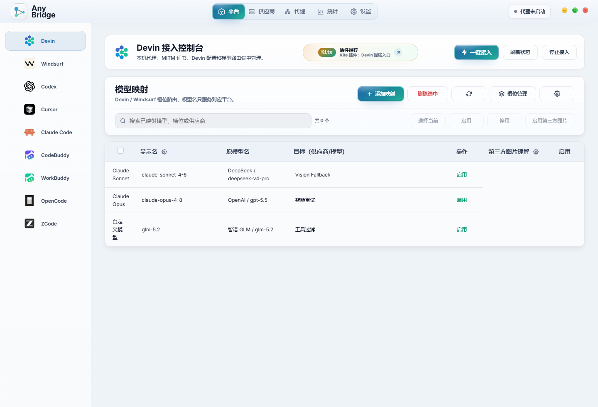
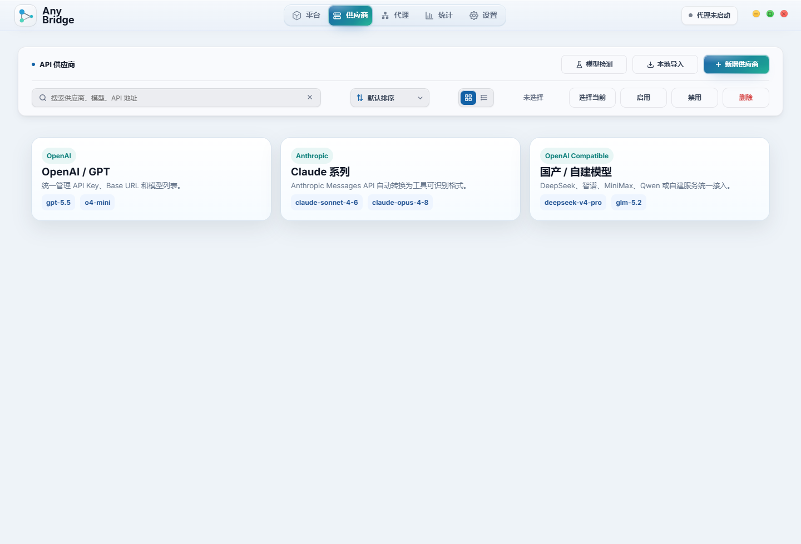
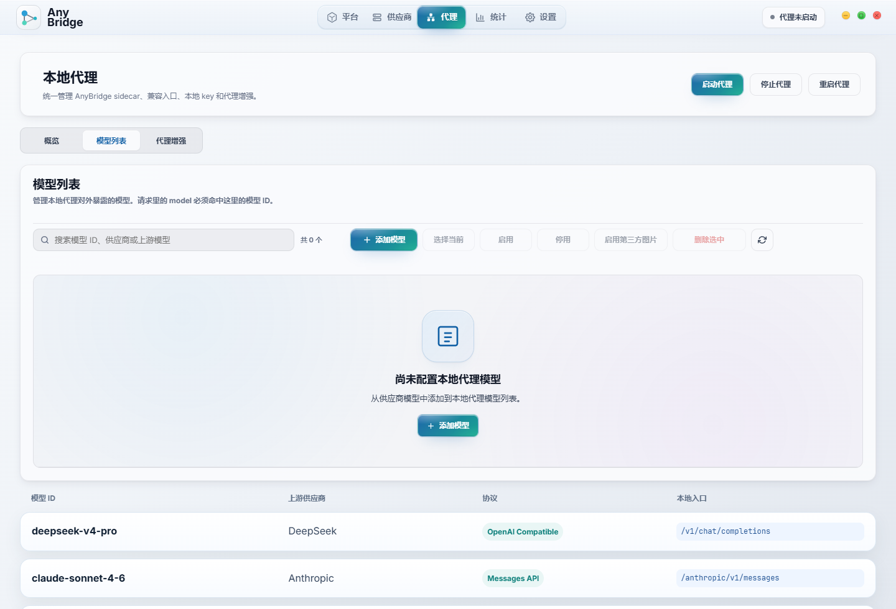
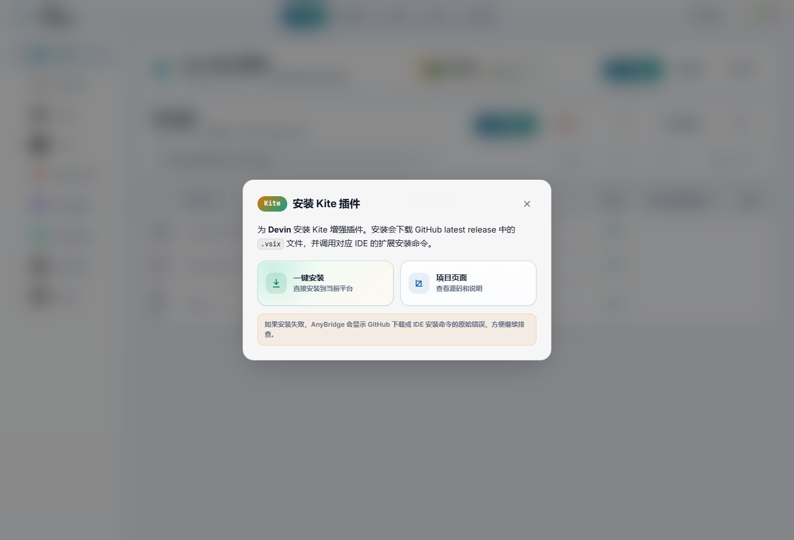
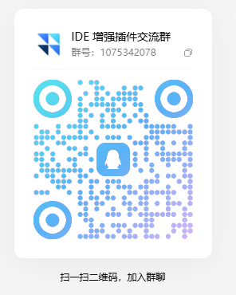

<div align="center">

# 🚀 AnyBridge

**把自己的 API Key、模型和 AI 编程工具统一接起来。**

[](LICENSE)
[](https://tauri.app/)
[](https://nodejs.org/)
[](https://www.rust-lang.org/)
[](https://github.com/soulvon/AnyBridge/releases)

[快速开始](#-快速开始) •
[功能特点](#-功能特点) •
[特色功能](#-特色功能) •
[Kite 增强插件](#-kite-增强插件推荐搭配) •
[怎么用](#-怎么用) •
[支持哪些工具](#-支持哪些工具) •
[参与贡献](#-参与贡献)

</div>

---

## AnyBridge 是什么

AnyBridge 是一个本地运行的 BYOK（Bring Your Own Key）桥接工具，帮你把自己的 API Key、模型供应商和常用 AI 编程工具连在一起。

现在 AI 编程工具很多，比如 Windsurf、Devin、Cursor、Claude Code、Codex、OpenCode 等，但它们通常各有自己的套餐、模型白名单和配置方式。你可能已经有 Anthropic、OpenAI、DeepSeek、智谱、MiniMax 或自建 OpenAI 兼容服务的 Key，却没法直接在某个工具里自由使用。

AnyBridge 解决的就是这件事：

1. 在本机管理你的模型供应商和 API Key
2. 根据目标工具选择代理接入、配置写入或本地 API 网关
3. 把工具发出的请求转到你配置的模型服务
4. 让你在熟悉的 AI 编程工具里使用自己的模型和账号

简单说，AnyBridge 负责“模型和 API 接入”，让工具不再被固定套餐或固定模型列表限制。

**三类接入方式：**

- **本地代理模式** —— 适合 Windsurf、Devin、Cursor 这类不直接开放 BYOK 的桌面 IDE。AnyBridge 只处理聊天相关请求，补全、索引、登录等流量正常放行。
- **配置切换模式** —— 适合 Claude Code、Codex、OpenCode、CodeBuddy 这类本身支持自定义 API 的工具。AnyBridge 自动写入配置文件，一键切换和恢复。
- **本地 API 网关** —— 适合任何支持 OpenAI 兼容接口的工具。把地址填成 `http://localhost:7450/v1`，就能调用你在 AnyBridge 里配置的模型。

---

## 🖼️ 界面预览

AnyBridge 提供桌面控制台，不需要手写复杂配置。供应商、模型映射、代理路由、平台接入和增强功能都可以在同一个界面里完成。



| 供应商统一管理 | 本地代理模型路由 |
|---|---|
|  |  |

---

## ✨ 功能特点

### 🔑 自带 Key，不买套餐

每个 AI 编程工具都要单独付费，而且都不便宜。AnyBridge 让你用自己已有的 API Key，不用再给每个工具交一份钱。

- 支持 Anthropic 格式的 Key（`sk-ant-...`）
- 支持 OpenAI 格式的 Key（`sk-...`）
- 支持任何兼容 OpenAI 或 Anthropic 接口的自建服务、第三方代理

### 🔀 统一管理供应商，便捷接入多个平台

在 AnyBridge 里配一次供应商，就能同时用到 Windsurf、Devin、Cursor、Claude Code、Codex 等多个工具上。不用每个工具单独配 Key。

```json
[
  {
    "name": "Anthropic 直连",
    "format": "anthropic",
    "api_key": "sk-ant-xxxx",
    "base_url": "https://api.anthropic.com",
    "enabled": true,
    "models": ["claude-sonnet-4-6", "claude-opus-4-8"]
  },
  {
    "name": "OpenAI",
    "format": "openai",
    "api_key": "sk-xxxx",
    "base_url": "https://api.openai.com/v1",
    "enabled": true,
    "models": ["gpt-5.5", "o4-mini"]
  },
  {
    "name": "智谱 GLM",
    "format": "openai",
    "api_key": "zhipu-xxxx",
    "base_url": "https://open.bigmodel.cn/api/paas/v4",
    "enabled": true,
    "models": ["glm-5.2", "glm-5.1"]
  },
  {
    "name": "DeepSeek",
    "format": "openai",
    "api_key": "sk-xxxx",
    "base_url": "https://api.deepseek.com",
    "enabled": true,
    "models": ["deepseek-v4-pro", "deepseek-v4-flash"]
  }
]
```

每个供应商可以单独启用/禁用。AnyBridge 会自动从启用的供应商里选一个来处理请求，你不用管底层是哪个供应商在响应。

### 📥 一键导入其他平台的供应商

如果你之前已经在其他工具里配过 API Key 和模型，不需要在 AnyBridge 里重新手填一遍。供应商页右上角提供 **「一键导入」**，可以自动扫描本机已有配置，把可用的供应商带进 AnyBridge。

目前支持从这些来源扫描：

- **CC Switch**：导入 Claude / Codex 供应商配置
- **Cockpit Tools**：导入 Codex 模型供应商配置
- **Cherry Studio**：导入本地供应商、API 地址、模型和能力信息

导入流程会先展示候选供应商，你可以确认来源、API 地址、模型列表和状态后再写入。AnyBridge 会标记已存在或信息不完整的候选项，避免重复导入和误导入。

### 🌐 聚合上游供应商，统一为 OpenAI 兼容格式输出

AnyBridge 可以把多个上游供应商聚合成一个统一的本地 API 端点。不管你配的是 Anthropic、DeepSeek 还是智谱，对外都暴露成标准的 OpenAI 兼容格式（`http://localhost:7450/v1/chat/completions`）。

这意味着：

- **所有模型一个接口** —— 不管背后是 Claude、GPT 还是国产模型，都用同一套 OpenAI 格式调用
- **接入更多工具** —— 只要是支持 OpenAI 兼容 API 的工具（比如 OpenCode、Cline、Continue 等），都能直接用 AnyBridge 的本地接口
- **格式自动转换** —— AnyBridge 会自动处理不同供应商之间的协议差异（比如 Anthropic 的 Messages API 转成 OpenAI 的 Chat Completions 格式）

```bash
# 所有模型都走同一个地址，换模型名就行
curl http://localhost:7450/v1/chat/completions \
  -H "Content-Type: application/json" \
  -d '{"model": "deepseek-v4-pro", "messages": [{"role": "user", "content": "你好"}]}'

curl http://localhost:7450/v1/chat/completions \
  -H "Content-Type: application/json" \
  -d '{"model": "glm-5.2", "messages": [{"role": "user", "content": "你好"}]}'

curl http://localhost:7450/v1/chat/completions \
  -H "Content-Type: application/json" \
  -d '{"model": "claude-sonnet-4-6", "messages": [{"role": "user", "content": "你好"}]}'
```

### 🔄 故障转移与智能重试

AnyBridge 会自动处理供应商不可用的情况：

- **故障转移** —— 如果一个供应商挂了（比如 API 超时、返回 5xx），AnyBridge 会自动切换到另一个启用的供应商，不影响你的使用
- **智能重试** —— 对临时性失败（网络抖动、限流），会自动重试，重试间隔递增，避免打爆 API
- **零配置** —— 只要配了多个供应商，这些能力默认就生效，不需要额外设置

### 🧩 模型映射

Windsurf 里写死了几个模型槽位（比如 "Claude Sonnet"、"Claude Opus"），但你完全可以用 AnyBridge 把这些槽位映射到你实际想用的模型上。

举个例子：
- Windsurf 里的 "Claude Sonnet" 槽位 → 实际走你的 **GPT-5.5**
- Windsurf 里的 "Claude Opus" 槽位 → 实际走你的 **DeepSeek-V4-Pro**
- 你还可以**解锁隐藏槽位**，或者**自己加新的模型选项**进去

### ⚙️ 三种接入方式，覆盖所有工具

AnyBridge 根据目标工具的特性，提供三种不同的接入方式：

**方式一：MITM 拦截 + 打补丁（适用于不支持 BYOK 的工具）**

Windsurf、Devin、Cursor 这些桌面 IDE 本身不支持自定义 API Key。AnyBridge 通过本地 MITM 代理劫持它们的聊天请求，同时给 IDE 的界面打补丁，把模型选择列表替换成你配的模型。

```
IDE 发请求 → AnyBridge MITM 代理拦截
     ↓
  识别出聊天 RPC 调用
     ↓
  提取请求参数，转换格式
     ↓
  发给你的供应商
     ↓
  拿到响应，转回 IDE 格式返回
```

- **只劫聊天** —— 补全、索引、登录等流量正常透传
- **一键切换/还原** —— 在 UI 点一下切换到 AnyBridge，再点一下恢复原始配置
- **界面补丁自动注入** —— 模型下拉菜单自动更新，显示你配的模型列表
- **HTTPS 证书自动管理** —— 一键生成安装，不用手动折腾

**方式二：面板快速配置（适用于原生支持 BYOK 的工具）**

CodeBuddy、Claude Code、Codex、OpenCode 这些工具本身支持自定义 API Key 和 Base URL，但需要你手动去翻文档找配置文件路径，手写 JSON 格式。

AnyBridge 的桌面面板把这些步骤全包了：

- 在 UI 里选工具 → 选供应商 → 点「切换」，AnyBridge 自动把 API Key 和接口地址写到正确的配置文件位置
- 不用记每个工具的配置文件路径，不用手写 JSON 格式
- 一键恢复原始配置，随时切回来
- 支持同时管理多个工具的配置

**方式三：代理聚合（通用能力，任何工具都能用）**

不管工具本身支不支持 BYOK，都可以通过 AnyBridge 的本地代理来调用你的模型。AnyBridge 把多个上游供应商聚合成一个统一的 OpenAI 兼容 API 端点：

```bash
# 所有模型走同一个地址，改模型名就行
curl http://localhost:7450/v1/chat/completions \
  -d '{"model": "deepseek-v4-pro", "messages": [{"role": "user", "content": "你好"}]}'

curl http://localhost:7450/v1/chat/completions \
  -d '{"model": "glm-5.2", "messages": [{"role": "user", "content": "你好"}]}'

curl http://localhost:7450/v1/chat/completions \
  -d '{"model": "claude-sonnet-4-6", "messages": [{"role": "user", "content": "你好"}]}'
```

### 📊 实时监控面板

桌面端有个仪表盘，能看到：

- 发了多少请求
- 用了多少 Token（输入/输出分开统计）
- 有多少错误
- 大概花了多少钱
- 当前在用哪些模型

### 🧪 配好了先测试一下

配置完供应商后，可以直接在 UI 里点「测试」，看看：

1. API 能不能连上
2. 能不能拉模型列表
3. 流式响应正不正常
4. 工具调用能不能用
5. 视觉功能（看图）有没有

### 🛡️ 一键证书管理

代理模式需要本机 HTTPS 证书来做流量拦截。AnyBridge 提供一键生成、安装和清理的功能，不用自己折腾 OpenSSL。

### 🔄 自动更新

桌面端有自动更新功能，新版本发布后会提示你更新。

---

## 🎯 特色功能

### 🖼️ 第三方图片理解（Vision Fallback）⭐ 核心亮点

**一句话：让不支持看图的模型也能看懂图片。**

这是个很少见但极其实用的功能。很多优秀的模型（尤其是国产模型）语言能力很强，但就是不支持多模态——你给它发一张截图，它直接报错或忽略。AnyBridge 的 Vision Fallback 相当于给这些「盲人模型」配了一双眼睛。

#### 解决了什么问题

你在 AI 编程工具里经常会贴图：
- 截个报错信息问怎么修
- 拍个 UI 设计稿让它生成代码
- 画个流程图让它解释
- 截个数据报表让它分析

但如果你用的是 DeepSeek-V4-Pro、GLM-5.2、Qwen 3.7 Max 这些模型，它们本身不支持看图——请求发过去就直接报错或者忽略图片。

没有 Vision Fallback 的话，你只能：
1. 换一个支持多模态的模型（但可能没你用的模型强）
2. 自己看图，手动打字描述给模型（麻烦）
3. 同时开两个工具，一个看图一个聊天（精分）

AnyBridge 的 Vision Fallback 让这一切自动化。

#### 工作原理

```
用户发送带图片的消息
       ↓
AnyBridge 拦截到请求
       ↓
  检查目标模型是否支持多模态
       ↓
  ┌── 支持（如 GPT-5.5、Claude Opus 4.8） → 直接转发，不做额外处理
  │
  └── 不支持（如 DeepSeek-V4-Pro、GLM-5.2）
          ↓
      从请求中提取图片数据（base64 或 URL）
          ↓
      把图片发给配置好的「视觉备用模型」
          ↓
      视觉模型分析图片，生成文字描述
        （“图中是一个 Python 报错，第 15 行有 SyntaxError...”）
          ↓
      AnyBridge 把原始请求中的图片替换成这段文字描述
          ↓
      目标模型收到纯文本请求，正常回复
          ↓
      用户看到的是目标模型的回答，完全不知道背后走了视觉模型
```

整个过程对用户完全透明，你看到的是 DeepSeek 的回答，但图片是 Mimo 2.5 帮它「看」的。

#### 配置方式

**方式一：全局视觉备用模型**

配一个默认的视觉模型，所有不支持看图的供应商都走它：

```json
{
  "vision_fallback": {
    "enabled": true,
    "provider": "my-vision-provider",
    "model": "mimo-2.5-vision",
    "description": "给所有非多模态模型当眼睛用"
  }
}
```

**方式二：按供应商单独指定**

不同供应商可以用不同的视觉模型，灵活搭配：

```json
[
  {
    "name": "DeepSeek",
    "api_key": "sk-xxx",
    "models": ["deepseek-v4-pro"],
    "vision_fallback": {
      "provider": "my-vision-provider",
      "model": "mimo-2.5-vision"
    }
  },
  {
    "name": "智谱 GLM",
    "api_key": "zhipu-xxx",
    "models": ["glm-5.2"],
    "vision_fallback": {
      "provider": "another-vision-provider",
      "model": "minimax-m3-vision"
    }
  }
]
```

**方式三：在供应商列表里指定视觉供应商**

```json
[
  {
    "id": "my-vision-provider",
    "name": "视觉备用",
    "format": "openai",
    "api_key": "sk-xxx",
    "base_url": "https://api.some-service.com/v1",
    "enabled": true,
    "models": ["mimo-2.5-vision", "minimax-m3-vision"]
  }
]
```

#### 支持哪些视觉模型

任何兼容 OpenAI 格式的多模态模型都可以当视觉备用：

| 模型 | 特点 |
|---|---|
| Mimo 2.5 Vision | 响应快，成本低，适合日常看图 |
| MiniMax M3 Vision | 图片理解准确率高，适合复杂图表 |
| GPT-5.5 | 通用能力强，什么图都能看 |
| Claude Opus 4.8 | 视觉理解顶级，适合专业场景 |
| 其他 OpenAI 兼容的多模态模型 | 随便配 |

#### 真实场景举例

**场景 1：Debug 截图**

你在 OpenCode 里用 DeepSeek-V4-Pro 写代码，遇到一个编译错误。你截图发给它问「这个报错什么意思？」。

- ❌ 没有 Vision Fallback：DeepSeek 报错或不理你
- ✅ 有 Vision Fallback：AnyBridge 自动把截图发给 Mimo 2.5 分析，得到「图中显示第 42 行有一个 NullPointerException，变量 user 未初始化」，然后 DeepSeek 基于这个描述给你解答

**场景 2：UI 转代码**

你想让 GLM-5.2 根据设计稿生成前端代码，但 GLM 不看图。

- ✅ Vision Fallback 自动把设计稿发给 MiniMax M3 描述一遍，GLM 收到描述后生成代码

**场景 3：数据分析**

你截了一张数据报表想问 DeepSeek 趋势分析。

- ✅ 截图自动转文字描述，DeepSeek 正常分析

#### 注意事项

- 视觉模型消耗额外 Token，费用会比纯文本对话略高
- 图片质量影响描述准确度，清晰截图效果最好
- 可以在 UI 里开启/关闭，不需要随时可以关掉
- 视觉模型的选择会影响响应速度——Mimo 2.5 最快，Claude Opus 最慢但最准

### 🖥️ Codex 桌面版：CDP 注入解锁模型列表

Codex Desktop 的模型选择器默认只显示官方支持的模型列表，你自己配的供应商模型不会出现在下拉菜单里。

AnyBridge 通过 **Chrome DevTools Protocol (CDP)** 注入的方式解决这个问题：

**工作原理：**

```
1. AnyBridge 启动 Codex Desktop 时附加 --remote-debugging-port 参数
2. 通过 CDP 连接到 Codex 的浏览器实例
3. 注入 JavaScript 脚本，动态修改模型选择器的下拉列表
4. 把你配的所有模型都加到选项里，按供应商分组展示
5. 选好模型后，请求走 AnyBridge 本地代理出去
```

- 不修改 Codex 二进制文件
- 不修改 Codex 的配置文件
- 纯运行时注入，重启 Codex 后自动恢复
- AnyBridge 退出时自动清理注入

### 🔐 解锁供应商限制：只在 Codex / Claude Code 专用目标里生效

有些上游供应商会提供“解锁”入口：例如 Codex 需要走 Codex Desktop 风格的 Responses 请求，Claude Code 需要走 Claude Code 风格的 Anthropic Messages 请求。这类入口不是普通 OpenAI / Anthropic API，不能当成通用供应商随便路由。

AnyBridge 现在会把解锁能力限制在对应平台目标里使用：

- **Codex 解锁** 只能用于 Codex 专用供应商或目标路由
- **Claude Code 解锁** 只能用于 Claude Code 专用供应商或目标路由
- 普通 OpenAI / Anthropic 兼容请求不会自动套用解锁模板
- 如果目标要求解锁，但供应商没有开启对应解锁能力，会直接报出明确错误

#### 为什么要做这个限制

解锁供应商通常依赖平台专属的请求契约：

- Codex 解锁需要 `include`、`prompt_cache_key`、Codex Desktop 来源标识等字段
- Claude Code 解锁需要 Claude Code beta 头、CLI user-agent、会话 metadata、thinking / effort 等字段
- 这些字段只对对应平台有意义，放到普通模型请求里可能导致上游拒绝、路由错乱或行为不可预期

所以 AnyBridge 不会“看见供应商开启了解锁就自动使用”。供应商上的解锁配置只代表“这个供应商具备某个平台的解锁能力”，真正是否启用，必须由具体目标显式选择。

#### 工作原理

```
用户在 Codex / Claude Code 里发起请求
       ↓
AnyBridge 找到当前模型对应的目标供应商
       ↓
检查目标是否显式声明 unlock 类型
       ↓
  ┌── unlock = codex
  │       ↓
  │   校验供应商已开启 Codex 解锁
  │       ↓
  │   使用 Codex 专用 wireApi、请求字段和请求头
  │
  ├── unlock = claudeCode
  │       ↓
  │   校验供应商已开启 Claude Code 解锁
  │       ↓
  │   使用 Claude Code 专用 wireApi、payload 和请求头
  │
  └── 未声明 unlock
          ↓
      按普通 OpenAI / Anthropic 兼容供应商处理
```

也就是说，解锁配置分成两层：

1. **供应商层**：声明这个供应商支持哪些解锁模板，例如 Codex 或 Claude Code。
2. **目标层**：当前模型路由明确选择 `unlock: "codex"` 或 `unlock: "claudeCode"`，AnyBridge 才会真正使用对应模板。

#### 使用说明

如果你在 UI 里配置解锁供应商，建议按平台分开管理：

- 给 Codex 用的供应商，只在 Codex 平台或 Codex 专用代理路由里选择
- 给 Claude Code 用的供应商，只在 Claude Code 平台或 Claude Code 专用目标里选择
- 不要把 Codex 解锁供应商拿去跑 Claude Code，也不要把 Claude Code 解锁供应商拿去跑普通 OpenAI 网关

配置文件里也遵循同样规则：目标路由需要显式写出解锁类型。

```json
{
  "providerId": "my-codex-unlock-provider",
  "model": "gpt-5-codex",
  "unlock": "codex"
}
```

```json
{
  "providerId": "my-claude-code-unlock-provider",
  "model": "claude-sonnet-4-6",
  "unlock": "claudeCode"
}
```

这样做的好处是边界更清晰：普通供应商继续走标准协议，解锁供应商只在对应平台里使用，出错时也会直接提示是哪一个供应商或目标配置不匹配。

### 🔌 Devin / Windsurf：MITM 劫持实现自定义模型接入

Devin 和 Windsurf 使用 Connect-RPC 协议（基于 HTTP/1.1 和 HTTP/2）与服务端通信，聊天请求走的也是这套协议。AnyBridge 通过 **MITM CONNECT 代理** 来实现自定义模型接入：

**工作原理：**

```
1. 把 IDE 的代理设置指向 AnyBridge（localhost:7450）
2. IDE 发出的所有 HTTPS 请求先经过 AnyBridge
3. AnyBridge 解析请求内容，识别出 GetChatMessage 等聊天 RPC 调用
4. 把聊天请求的参数提取出来，转换成目标供应商的格式
5. 发给你配的供应商（Anthropic、OpenAI、DeepSeek 等）
6. 拿到响应后，再转回 IDE 能识别的格式返回
7. 非聊天流量（登录、补全、遥测等）直接透传，不做任何处理
```

- **只劫聊天，其他不管** —— 不影响 IDE 的正常功能
- **自动证书管理** —— 一键生成和安装 MITM 所需的 CA 证书
- **协议转换** —— 自动处理 Connect-RPC 和标准 OpenAI/Anthropic 格式之间的互转
- **流式支持** —— SSE 流式响应正常

### ⚡ 代理增强功能

除了基本的路由和转发，AnyBridge 的代理层还提供了一系列增强能力：

**故障转移** —— 配了多个供应商的情况下，如果当前供应商挂了（超时、5xx），自动切换到下一个可用的供应商，请求不受影响。

**智能重试** —— 遇到临时性失败（网络抖动、限流 429），自动重试，重试间隔递增（1s → 2s → 4s），避免打爆 API。

**格式自动转换** —— 上游供应商用 Anthropic 格式，下游工具用 OpenAI 格式？AnyBridge 自动在两者之间互转，你不用操心协议差异。

**流式响应加速** —— 对流式 SSE 响应做了特殊优化，首 token 延迟更低，中间 token 转发更流畅。

**请求缓存** —— 对嵌入向量等幂等请求，支持本地缓存，减少重复调用和费用。

**连接池复用** —— 复用与上游供应商的 HTTP 连接，减少握手开销，提高并发吞吐。

**本地 Fallback** —— 代理异常退出时自动清理系统代理设置，不遗留脏状态。

---

## 🪁 Kite 增强插件推荐搭配

[Kite](https://github.com/soulvon/Kite) 是面向 **Devin** 和 **Windsurf** 的增强插件，适合和 AnyBridge 搭配使用。

如果说 AnyBridge 解决的是“模型和 API 怎么接入”的问题，那么 Kite 更偏向解决“IDE 用起来怎么更顺手”的问题。两者组合后，可以同时获得自定义模型接入和更完整的 IDE 增强体验。

Kite 目前聚焦 Devin / Windsurf 的日常增强场景：

- **号池能力** —— 面向多账号、多工作区或团队使用场景，降低频繁切换账号的成本。
- **界面汉化** —— 对常用入口和提示做中文化处理，让中文用户上手更轻松。
- **体验增强** —— 补充一些原工具没有直接提供、但高频使用会明显提升效率的入口和交互。
- **与 AnyBridge 联动** —— AnyBridge 的平台控制台内置 Kite 入口，可以直接跳转项目页，也支持一键安装 `.vsix` 插件包。



项目地址：[soulvon/Kite](https://github.com/soulvon/Kite)

---

## 💻 怎么用

下面分几种场景，你可以根据自己的需求选一种。

### 场景一：只用命令行工具（Claude Code / Codex 等）

如果你只用命令行工具，不需要桌面界面，只需要跑代理服务。

```bash
# 1. 装依赖
git clone https://github.com/soulvon/AnyBridge.git
cd AnyBridge
npm install
cd sidecar && npm install && cd ..

# 2. 启动代理
npm run start
```

代理启动后，打开桌面 UI 配一下供应商和平台切换。或者你也可以直接写配置文件：

```bash
# 配置文件在 %APPDATA%/com.anybridge/providers.json（Windows）
# 或者 ~/.config/com.anybridge/providers.json（Linux/Mac）
```

然后在桌面 UI 里点一下对应平台的「切换」，AnyBridge 就会自动把 API Key 写到那个工具的配置文件里。

> **小提示：** 配置模式下，切换完成后代理就可以关掉了。工具会直连你的供应商，不经过 AnyBridge。

### 场景二：用 Windsurf / Devin / Cursor（需要代理模式）

这些桌面 IDE 需要用代理模式，因为它们是走网络请求的。

```bash
# 1. 装依赖并启动代理
git clone https://github.com/soulvon/AnyBridge.git
cd AnyBridge
npm install
cd sidecar && npm install && cd ..
npm run start

# 2. 在桌面 UI 里配置供应商
# 3. 在 UI 里点「切换到代理模式」
# 4. 重启 IDE
```

你也可以直接写配置文件（`%APPDATA%/com.anybridge/providers.json`），支持混搭各种模型：

```json
[
  {
    "id": "my-anthropic",
    "name": "Anthropic",
    "format": "anthropic",
    "api_key": "sk-ant-你的key",
    "base_url": "https://api.anthropic.com",
    "enabled": true,
    "models": ["claude-sonnet-4-6", "claude-opus-4-8"]
  },
  {
    "id": "my-deepseek",
    "name": "DeepSeek",
    "format": "openai",
    "api_key": "sk-你的key",
    "base_url": "https://api.deepseek.com",
    "enabled": true,
    "models": ["deepseek-v4-pro", "deepseek-v4-flash"]
  },
  {
    "id": "my-zhipu",
    "name": "智谱 GLM",
    "format": "openai",
    "api_key": "zhipu-你的key",
    "base_url": "https://open.bigmodel.cn/api/paas/v4",
    "enabled": true,
    "models": ["glm-5.2", "glm-5.1"]
  }
]
```

切换后，你的 IDE 聊天请求就会走 AnyBridge 的本地代理了。

**怎么验证是不是生效了？**

```bash
# 看看代理的健康状态
curl http://localhost:7450/__byok/health

# 看看统计数据
curl http://localhost:7450/__byok/stats
```

如果健康检查返回 `{"status":"ok"}` 说明代理在跑。

### 场景三：把 AnyBridge 当本地 API 网关用

AnyBridge 可以把你的模型暴露成标准 API，这样任何工具都能调用：

```bash
# OpenAI 兼容格式 —— 用 Claude 模型
curl http://localhost:7450/v1/chat/completions \
  -H "Content-Type: application/json" \
  -d '{
    "model": "claude-sonnet-4-6",
    "messages": [{"role": "user", "content": "你好"}]
  }'

# OpenAI 兼容格式 —— 用 DeepSeek 模型
curl http://localhost:7450/v1/chat/completions \
  -H "Content-Type: application/json" \
  -d '{
    "model": "deepseek-v4-pro",
    "messages": [{"role": "user", "content": "写一段快速排序"}]
  }'

# OpenAI 兼容格式 —— 用智谱 GLM-5.2
curl http://localhost:7450/v1/chat/completions \
  -H "Content-Type: application/json" \
  -d '{
    "model": "glm-5.2",
    "messages": [{"role": "user", "content": "解释一下量子计算"}]
  }'

# Anthropic 兼容格式
curl http://localhost:7450/anthropic/v1/messages \
  -H "Content-Type: application/json" \
  -H "x-api-key: sk-ant-你的key" \
  -d '{
    "model": "claude-opus-4-8",
    "max_tokens": 1024,
    "messages": [{"role": "user", "content": "写一个冒泡排序"}]
  }'
```

这样你可以在任何支持自定义 API 的工具里，把接口地址填成 `http://localhost:7450/v1`，就能用到你配的所有模型。

### 场景四：同时用桌面端和代理（最完整体验）

```bash
# 装依赖
npm install
cd sidecar && npm install && cd ..

# 启动桌面应用（会自动启动代理）
npm run tauri:dev
```

桌面 UI 打开后，你可以在一个界面里完成所有操作：

1. **供应商管理** — 添加、编辑、启用/禁用供应商
2. **模型映射** — 配好 IDE 槽位和实际模型的对应关系
3. **代理路由** — 把模型暴露成本地 API
4. **平台切换** — 一键切换到 AnyBridge 模式 / 恢复原始配置
5. **监控面板** — 看实时流量和统计
6. **连通性测试** — 点一下测试按钮

### 常见操作

**一键导入已有供应商：**

如果你已经在 CC Switch、Cockpit Tools 或 Cherry Studio 里配过供应商，可以在供应商页点右上角「一键导入」：

1. 选择要扫描的平台来源
2. 点「开始扫描」
3. 在候选列表里确认可导入项
4. 点「导入选中项」写入 AnyBridge 供应商列表

导入前会先检查重复项和缺失信息，不会直接覆盖你现有的供应商配置。

**添加一个新供应商：**

在 UI 里点「添加供应商」，填这几个东西就行：

| 字段 | 说明 | 例子 |
|---|---|---|
| 名称 | 你自己起的名字 | "我的 Anthropic" / "智谱 GLM" / "DeepSeek" |
| 格式 | `anthropic` 或 `openai` | `openai`（国产模型全是 OpenAI 兼容格式） |
| API Key | 你的密钥 | `sk-ant-xxxx` / `zhipu-xxxx` |
| 接口地址 | API 的地址 | `https://api.anthropic.com` / `https://open.bigmodel.cn/api/paas/v4` / `https://api.deepseek.com` |
| 模型列表 | 你想用哪些模型 | `["claude-sonnet-4-6", "glm-5.2", "deepseek-v4-pro"]` |

**切换平台：**

在 UI 里找到你想用的工具，点「切换到 AnyBridge」。想恢复原来的配置，点「恢复原始配置」。

**查看代理日志：**

```bash
# 导出日志
# 在桌面 UI 里点「导出日志」
# 或者直接去配置目录找
```

---

## 🎯 支持哪些工具

| 工具 | 接入方式 | 状态 |
|---|---|---|
| Windsurf | 本地代理 | ✅ 能用 |
| Devin | 本地代理 | ✅ 能用 |
| Cursor | 本地代理 | ✅ 能用 |
| Claude Code | 配置切换 | ✅ 能用 |
| Codex | 配置切换 | ✅ 能用 |
| CodeBuddy | 配置切换 | ✅ 能用 |
| OpenCode | 配置切换 | ✅ 能用 |
| ZCode | 配置切换 | ✅ 能用 |
| WorkBuddy | 配置切换 | ✅ 能用 |

---

## 📦 快速开始（简洁版）

### 环境要求

- **Node.js** >= 20
- 编译桌面端需要 **Rust** 工具链
- 编译代理程序需要 **Python 3**

### 一条龙

```bash
git clone https://github.com/soulvon/AnyBridge.git
cd AnyBridge
npm install
cd sidecar && npm install && cd ..
npm run start
```

### 常用命令

```bash
npm run start              # 启动代理
npm run dev                # 启动代理（带文件监听）
npm run tauri:dev          # 启动桌面应用
npm run tauri:build        # 打包发布版
python scripts/build/build_sidecar_plain.py  # 编译代理程序
```

---

## 📂 项目结构

```
AnyBridge/
├── sidecar/                # Node.js 代理（核心逻辑）
│   ├── proxy-entry.js      # 入口文件
│   ├── hybrid-server.js    # HTTP/1.1 代理
│   ├── inference-proxy.js  # HTTP/2 推理代理
│   ├── local-proxy.js      # 本地反向代理
│   ├── cursor-proxy.js     # Cursor 专用代理
│   ├── handlers/           # 请求处理
│   │   ├── chat.js         # 聊天拦截与路由
│   │   ├── anthropic-stream.js
│   │   └── openai-stream.js
│   ├── lib/                # 工具库
│   ├── provider-pool.js    # 供应商路由选择
│   ├── stats.js            # 统计
│   └── vision-fallback.js  # 视觉降级
├── src-tauri/              # Rust 桌面应用
│   ├── src/
│   │   ├── main.rs         # 入口
│   │   ├── lib.rs          # 初始化
│   │   ├── antidebug.rs    # 反调试
│   │   ├── integrity.rs    # 完整性校验
│   │   └── commands/       # 各功能模块
│   └── tauri.conf.json     # 配置
├── ui-src/                 # 前端 HTML 源码（partials + 壳）
├── ui/                     # 前端产物（Tauri 加载）
│   ├── index.html          # 由 npm run build:ui 从 ui-src 拼装
│   └── assets/             # CSS + JS
├── scripts/                # 构建脚本
├── docs/                   # 文档
├── CHANGELOG.md            # 更新日志
└── LICENSE                 # MIT
```

---

## 🛠️ 技术特点

| 层面 | 选型 | 说明 |
|---|---|---|
| 桌面框架 | Tauri v2 | 比 Electron 更轻量，安装包小，内存占用低 |
| 后端语言 | Rust | 主要负责系统级操作：进程管理、文件读写、证书生成、配置持久化 |
| 前端 | 纯 HTML/CSS/JS | 无 React/Vue；HTML 用轻量 `@include` 拼装，CSS/JS 手拆模块 |
| 代理服务 | Node.js | 独立进程，负责 HTTP 代理、请求路由、协议转换 |
| 代理打包 | pkg | 把 Node.js 代码编译成单文件 exe，用户不需要装 Node |
| 存储 | SQLite | 缓存模型列表、统计数据和测试报告 |


### 后端（Rust）主要职责

- 读写配置文件
- 启动/停止代理进程
- 管理 HTTPS 证书
- 检测已安装的工具
- 修改目标工具的配置文件
- 提供 IPC 接口给前端调用

### 代理（Node.js）主要职责

- 运行 HTTP/HTTPS 代理
- 拦截并识别聊天请求
- 把请求转换成目标供应商的格式
- 把供应商的响应转回工具能识别的格式
- 处理流式响应（SSE）
- 记录请求和 Token 统计

---

## 🤝 参与贡献

欢迎来帮忙！不管是修 Bug、加功能、还是改进文档，都欢迎。

- 🐛 发现 Bug → [提 Issue](https://github.com/soulvon/AnyBridge/issues)
- 💡 有想法 → 发 [Discussion](https://github.com/soulvon/AnyBridge/discussions)
- 🔧 想写代码 → 直接开 Pull Request 或先开 Issue 对齐方案

> **注意：** 别把 API Key、证书、抓包数据提交到 Git 里。

---

## ⚠️ 注意事项

AnyBridge 会修改本地工具的配置，代理模式会拦截 HTTPS 流量。请确保你有权使用这些工具和 API Key。

- 用代理模式前，看看工具的服务条款和公司的安全规定
- 你的 API Key 只留在本地，AnyBridge 不会往外传
- **本项目与 Windsurf、Devin、OpenAI、Anthropic 等公司没有关系**

---

## ☕ 支持一下

如果 AnyBridge 帮你省了时间，欢迎请我喝杯咖啡～

<div align="center">


</div>

### 💬 交流群

**QQ 群：1075342078**（注明 "AnyBridge"）

群里有最新版本通知、使用帮助、配置分享。

<div align="center">



</div>

## 📄 开源协议

[MIT](LICENSE) © 2026 [soulvon](https://github.com/soulvon)

---

<div align="center">
**AnyBridge —— 打破锁定，自带密钥。**

<p align="center">
  <a href="https://github.com/soulvon/AnyBridge/issues">报 Bug</a> •
  <a href="https://github.com/soulvon/AnyBridge/discussions">提建议</a> •
  <a href="https://github.com/soulvon/AnyBridge">GitHub 主页</a>
</p>

</div>
