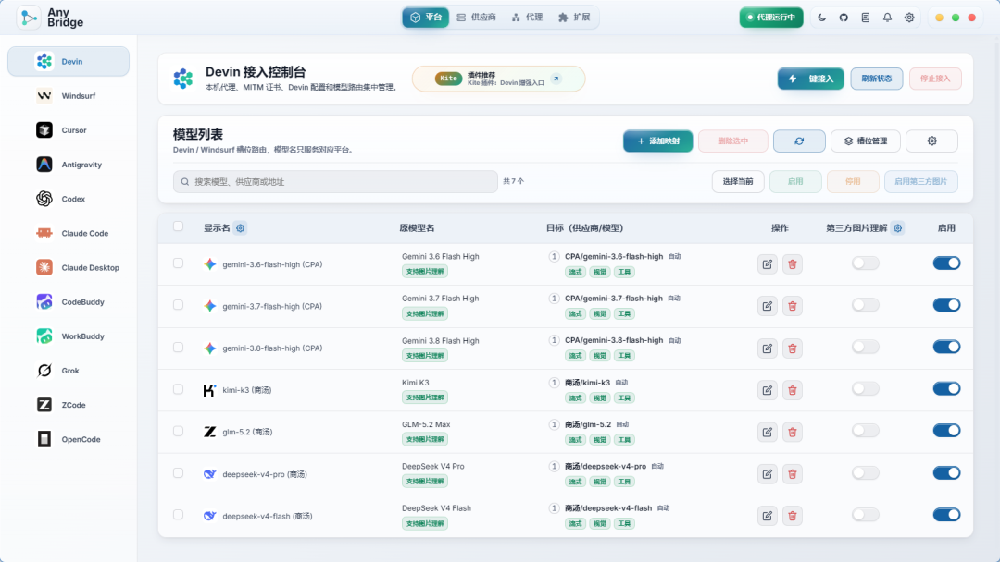
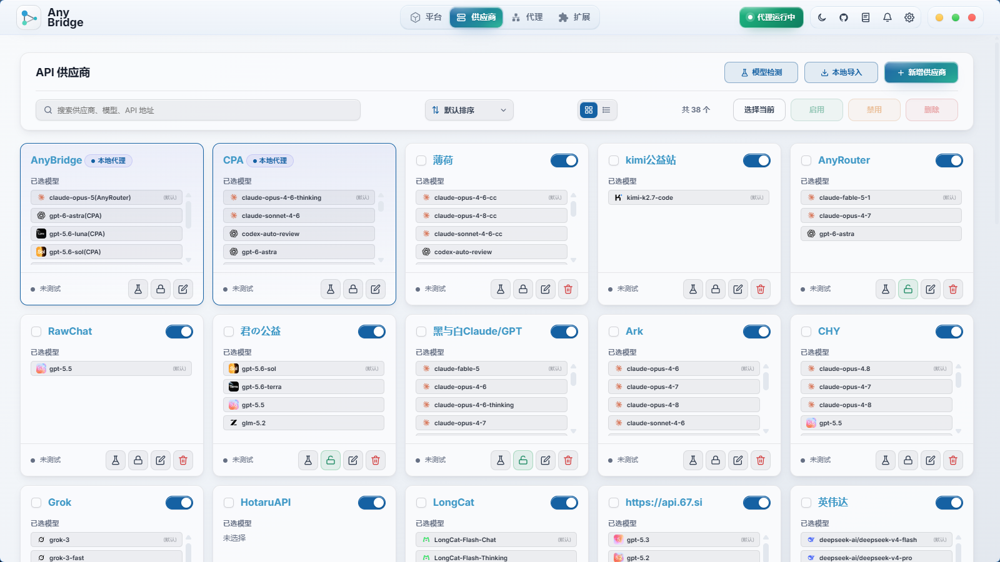
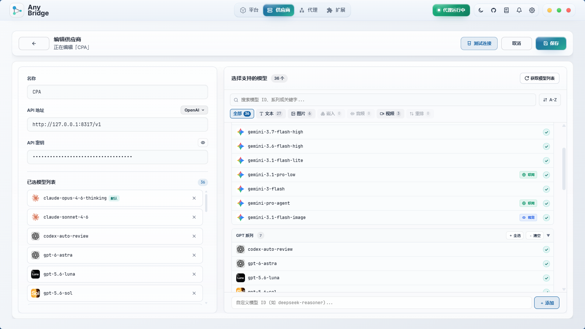
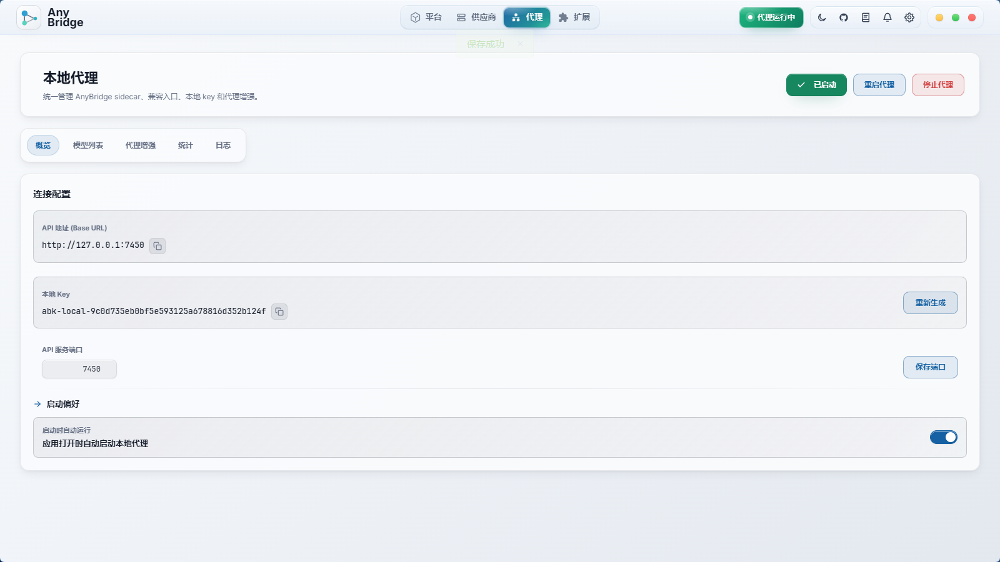
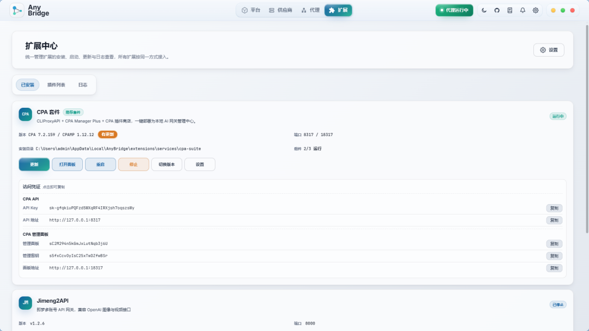
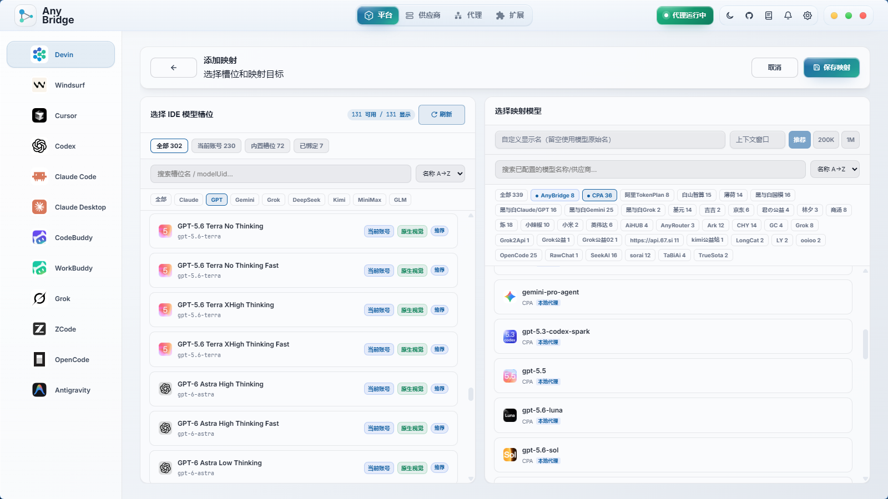
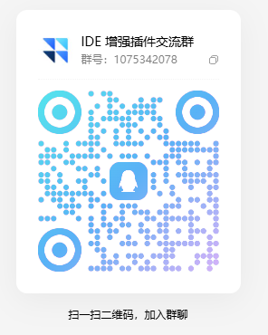

<div align="center">

# 🚀 AnyBridge

### 让各类 AI 编程工具自由接入,快捷的配置第三方渠道商自定义模型
**AI 编程助手的一站式 BYOK（自带渠道 / Key）本地客户端 · 支持 12+ 款桌面 IDE 与 CLI 工具**

[](LICENSE)
[](https://tauri.app/)
[]()
[](https://github.com/soulvon/AnyBridge/releases)

[English](README_en.md) • [简体中文](README.md)

[📥 立即下载](#-下载与安装) •
[⚡ 常见痛点对比](#-核心痛点与解决方式) •
[🚀 三步快速上手](#-快速上手只需三步) •
[🔬 工作原理](#-工作原理与技术实现) •
[🎯 支持工具完整清单](#-支持开发工具完整清单) •
[❓ 常见问题 FAQ](#-常见问题-faq) •
[💬 交流与支持](#-交流群与赞助支持)

<br>

**平日写代码，哪个 IDE 顺手就用哪个！**  
AnyBridge 是一款简单方便的本地 **BYOK（自带渠道 / Key）模型接入与配置管理客户端**，专门解决各类 AI 编程工具无法自由配置模型或手写配置麻烦的痛点。无需手写配置文件，无需搭建复杂环境，在图形界面操作，即可把第三方中转站（OneAPI / NewAPI / CPA 等）、自建网关以及 DeepSeek、Claude、GPT 等自定义模型，快捷接入你顺手的各个桌面 IDE 与终端 CLI 工具中。

</div>

---

<!-- ========================================== -->
<!-- 模块一：小白与终端用户视角（下载 + 快速上手） -->
<!-- ========================================== -->

## 📥 下载与安装

桌面安装包开箱即用，**无需安装 Node.js、Python 或任何命令行环境**，小白双击即可运行：

👉 **[点击直接下载 AnyBridge 最新正式版（GitHub Releases）](https://github.com/soulvon/AnyBridge/releases)**

| 操作系统 | 推荐安装包 | 安装与运行说明 |
| :--- | :--- | :--- |
| **🪟 Windows** | `.msi` 或 `Setup.exe` | 双击运行安装向导，按提示一路下一步即可完成 |
| **🍏 macOS** | `.dmg` | 双击打开镜像，将 AnyBridge 拖入「应用程序 (Applications)」目录 |
| **🐧 Linux** | `.AppImage` 或 `.deb` | 双击直接运行（AppImage 需先授予可执行权限：`chmod +x *.AppImage`） |

---

## ⚡ 核心痛点与解决方式

开发者平时使用多款开发工具，经常遇到**模型被锁死、各个工具配置分散、手写配置文件容易出错**等问题。看看 AnyBridge 是怎么处理的：

| 遇到什么问题 | 默认情况 / 手动处理 | AnyBridge 的处理方式 |
| :--- | :--- | :--- |
| **IDE 无法接入第三方模型** | Devin、Windsurf、Cursor 界面封闭，没有提供填写第三方 API 的入口 | **本地代理接入**：通过本地代理接管会话，可以自由连接你自己的渠道和模型 |
| **手写配置文件繁琐易错** | Codex、CodeBuddy、Claude Code 虽支持自定义，但要找隐藏目录手写 JSON | **界面一键写入**：在软件界面选好后直接写入配置，不用手写，随时可以一键还原 |
| **每次都要手输模型名** | 很多工具需要手动输入长串模型名，输错一个字母就会报错 | **在线拉取模型**：填好渠道后可直接在线拉取可用模型列表，在下拉框里直接勾选 |
| **换个渠道每个工具都要改** | 手上有几个工具就得挨个改几遍，上游换了地址每个配置文件都要翻出来 | **一次配置多处使用**：渠道集中在 AnyBridge 里管理，配一次即可直接同步给各个工具 |
| **纯文本模型无法看图** | 用 DeepSeek 等模型时发报错截图，模型直接报错说不支持图片 | **看图备用（Vision Fallback）**：后台自动调用轻量视觉模型把图片转成文字描述，纯文本模型也能看懂 |
| **外部工具无法共用** | 只能给单个 IDE 使用，其他脚本或小工具无法共用这套配置好的模型 | **本地统一接口**：在本地提供标准的 OpenAI 兼容接口（`:7450/v1`），其他客户端也能连进来 |
| **本地网关部署麻烦** | 想自建聚合网关需要单独安装配置环境 | **内置扩展中心**：支持一键安装和运行本地 CPA 网关，开箱即用 |
| **多个工具经常换着用** | 不同场景习惯用不同的 IDE，配置起来很分散 | **统一管理**：支持 12+ 款常用开发工具，平时哪个顺手用哪个 |

---

## 🚀 快速上手（只需三步）

下载并启动 AnyBridge 客户端后，日常使用只需简单三步：

```
[第一步：添加/导入渠道商] ──► [第二步：选择平台一键启用] ──► [第三步：打开 IDE 直接开用]
```

### 1️⃣ 第一步：添加或导入渠道商（支持在线拉取模型）
打开 AnyBridge，进入 **「供应商」** 页面：
- **直观添加与拉取**：点击「添加供应商」，填入渠道地址与 API 密钥，**支持直接在线拉取模型列表**，在下拉框中勾选你想用的模型；
- **一键导入生态配置**：支持自动扫描并一键导入 **Cherry Studio**、**CC Switch** 和 **Cockpit Tools** 中已配置好的渠道商与模型，导入前支持查看候选预览，自动去重防错；

### 2️⃣ 第二步：选择你想接入的开发工具（一键直配）
进入 **「平台」** 页面，找到你顺手的开发工具（如 Devin、Windsurf、Cursor、Codex、CodeBuddy、Claude Code 等）：
- **封闭式 IDE（Windsurf / Devin / Cursor）**：点击「启用代理接管」，软件自动建立本地网络代理与必要证书；
- **配置型工具（Codex / CodeBuddy / Claude Code）**：点击「切换到 AnyBridge」，**无需手写配置**，自动将参数写入对应系统路径。

### 3️⃣ 第三步：打开 IDE，直接开用！
和平时一样打开你的 IDE，在对话框里正常提问和写代码，会话请求就已经无缝切到你配置的自定义模型了！

> 💡 **随时一键还原**：在平台页面随时点击「恢复原始配置」，即可秒级切回官方默认状态。

---

## 🖼️ 界面预览

全图形化直观操作，涵盖**渠道商管理**、**模型槽位映射**、**第三方看图备用**、**平台一键接入**与**扩展中心**：





---

<!-- ========================================== -->
<!-- 模块二：进阶与专业人员视角（硬核实现原理） -->
<!-- ========================================== -->

## 🔬 工作原理与技术实现

这一节简单说明 AnyBridge 在底层是如何连接不同工具与模型的：

```
                           ┌───────────────────────────┐
                           │    AnyBridge 桌面端       │
                           │   (Tauri v2 + Rust)       │
                           └─────────────┬─────────────┘
                                         │ 本地控制
                                         ▼
┌─────────────────────────────────────────────────────────────────────────────┐
│                            本地代理服务 (:7450)                              │
│                                                                             │
│   ┌───────────────────────┐   ┌───────────────────────┐   ┌─────────────┐   │
│   │   协议解析与转换      │   │  看图备用自动转写     │   │ 渠道切换与  │   │
│   │  (Connect-RPC / SSE)  │   │   (Vision Fallback)   │   │ 限流自动重试│   │
│   └───────────────────────┘   └───────────────────────┘   └─────────────┘   │
└───────────────▲───────────────────────────────▲──────────────────────▲──────┘
                │ 本地代理                      │ 调试端口注入 (CDP)   │ 本地代理
    ┌───────────┴───────────┐       ┌───────────┴───────────┐          │
    │  Windsurf / Devin IDE │       │  Codex 桌面客户端     │          │
    │  (Connect-RPC 协议)   │       │  (动态添加模型选项)   │          │
    └───────────────────────┘       └───────────────────────┘          │
                                                            ┌──────────┴──────────┐
                                                            │ Claude Code / 外部工具│
                                                            │ (写入配置 / 本地网关) │
                                                            └─────────────────────┘
```

---

### 1. 🔌 Devin / Windsurf 是怎么接入的？（本地代理 + 协议转换）

Devin 与 Windsurf 的客户端使用 Connect-RPC 协议（一种基于 HTTP/2 的网络通信格式）与服务器交互，界面上没有留出自定义接口地址的输入框。

**AnyBridge 的处理流程：**

```
IDE 发出请求
    │
    ▼
[AnyBridge 本地代理 (127.0.0.1:7450)]
    │
    ├─► 1. 识别请求类型：只拦截聊天会话（如 GetChatMessage）
    ├─► 2. 解出对话内容，转换为标准 OpenAI 或 Anthropic 格式发给你的渠道商
    ├─► 3. 收到流式回复后，重新打包为 Connect-RPC 格式推回给 IDE 界面
    │
    ▼
其他非聊天流量（代码补全、文件索引检索、账号登录验证等）
    │
    └─► 直接原样放行，走官方原有网络链路，不增加额外延迟
```

- **不影响日常使用**：只有在聊天窗口提问时才会经过转换，代码自动补全和登录依然走官方通道；
- **本地证书自动生成**：首次开启时自动生成并信任本地证书，不需要手动配置；
- **跨协议自动转译**：上游供应商是 Anthropic 格式，下游工具只认 OpenAI 格式（或反过来），AnyBridge 会自动完成协议参数与流式事件的无缝互转。

---

### 2. 🖼️ 第三方看图（Vision Fallback）是怎么运作的？

很多写代码很强的模型（如 DeepSeek）是纯文本模型，直接给它发报错截图会导致报错或请求被拒。

**AnyBridge 的处理逻辑：**

```
你在 IDE 聊天框中发送带截图的消息
                │
                ▼
AnyBridge 检查目标模型是否支持图片输入
                │
       ┌────────┴────────┐
       ▼ [支持]          ▼ [不支持（纯文本模型）]
   直接正常发送          自动把图片提取出来，先发给一个轻量的视觉模型（如 Mimo 2.5 / MiniMax）
                         │
                         ▼
                       视觉模型生成文字版报错描述：
                       “图中第 42 行报错：NullPointerException，变量 user 为 null...”
                         │
                         ▼
                       AnyBridge 自动把原请求里的图片替换成这段文字描述
                         │
                         ▼
                       目标纯文本模型收到纯文字内容，正常给出解答方案
```

整个过程在后台自动完成，发截图时无需手动切换模型。
- **支持按渠道独立指定**：既可以设置全局通用的看图模型，也能在具体供应商编辑弹窗里单独为某个渠道指定专属的视觉模型。

| 常用视觉模型 | 特点说明 |
|---|---|
| **Mimo 2.5 Vision** | 速度快、费用低，适合日常代码报错截图 |
| **MiniMax M3 Vision** | 复杂图表和架构图解析效果较好 |
| **Gemini Flash** | 响应极快、性价比极高，多模态看图理解极强 |


---

### 3. 🖥️ Codex 桌面版是怎么显示自定义模型的？（CDP 运行时注入）

Codex 桌面版的模型下拉菜单是预先写死的，即使改了本地配置文件，界面上也选不到新模型。

**AnyBridge 的做法：**
1. 启动 Codex 时加上远程调试参数；
2. 通过 Chrome 调试协议（CDP）连接到 Codex 的界面；
3. 注入一段小脚本，把你在 AnyBridge 里配好的模型追加到下拉菜单中展示；
4. 切换渠道时自动处理历史会话索引和过期登录缓存，防止历史记录在重启后消失。

这种方式**不会修改 Codex 的任何本地程序文件**，关闭 AnyBridge 后重启 Codex 即可恢复官方原本的界面。



---

### 4. 🔐 专属“解锁功能（Unlock）”到底是什么？解决了什么痛点？

很多经常使用第三方中转站（如 AnyRouter 等）的开发者会发现：部分渠道商会单独提供价格极低、并发极高、支持深度思考的**“Claude Code 专属专线”**或**“Codex 专属专线”**。

但这些专线通常有一个致命门槛：**上游中转站会严格校验客户端指纹**！
- 如果你直接用普通工具（如 Windsurf / Devin / 外部脚本）去调这些专线，上游会因为缺少原厂特定的 `anthropic-beta` 请求头、会话元数据（Metadata）、`thinking` 深度思考参数或原生 Tools 指纹，**直接返回 503 Service Unavailable 或 400 报错拒绝服务**。

**AnyBridge 的“解锁（Unlock）”功能就是为了解决这个问题：**

1. **自动补齐原厂客户端协议指纹**：当你将某个渠道标记为 `Claude Code Unlock` 或 `Codex Unlock` 时，AnyBridge 会在本地自动模拟构造出与官方原厂客户端完全一致的请求特征（包括专属 Beta 协议头、Thinking 思考参数以及会话指纹）；
2. **让任意 IDE 畅享低成本专线**：即使你日常使用的是 Windsurf 或 Devin，会话经过 AnyBridge 转换后，也能顺利通过中转站的指纹校验，无痛使用原本只能在官方 CLI 里运行的高性价比专线；
3. **严格的作用域隔离**：普通模型请求继续保持纯净的 OpenAI / Anthropic 标准协议，只有明确匹配专属解锁渠道时才会注入特殊字段，绝不互相污染或引发未知报错。

```
你平时顺手的 IDE (Windsurf / Devin 等)
                │
                ▼
      AnyBridge 本地代理拦截
                │
     检测是否启用了 Unlock 专属解锁？
                │
       ┌────────┴────────┐
       ▼ [是 (如匹配 Claude Code 专线)]   ▼ [否 (普通标准渠道)]
自动补齐官方原厂 Beta 头、Thinking 参数与指纹    保持标准协议格式透传
                │
                ▼
中转站专线顺利通过指纹校验，正常响应（不再被 503 拦截！）
```

---

### 5. 💡 配置直写模式 vs 代理接管模式：两者有什么区别？

很多用户好奇为什么有的工具切换后可以关掉软件，有的却必须保持运行？这里简单讲清两者的区别：

- **配置直写模式（针对 Claude Code / Codex CLI / CodeBuddy 等）**：
  - **原理**：这些工具本身支持在配置文件里填自定义 Base URL 和 API 密钥。AnyBridge 只是在界面上帮你自动找到它们深层的隐藏文件，把配置规范地写进去。
  - **特点**：**点完切换后，你可以直接关闭 AnyBridge 桌面端**。工具会直接向你的渠道商发起网络请求，完全不占用本地后台资源。想换回官方时，再打开 AnyBridge 点一下「恢复」即可。

- **本地代理模式（针对 Windsurf / Devin / Cursor 等）**：
  - **原理**：这些 IDE 的官方界面完全封闭，不提供自定义 API 入口。AnyBridge 通过本地网络代理（127.0.0.1:7450）在会话发出前进行实时协议转译和模型替换。
  - **特点**：**使用此类 IDE 期间需保持 AnyBridge 运行**。它会在后台静默工作，同时为你提供看图备用（Vision Fallback）、自动重试等增强能力。

---

### 6. 📁 会话历史记录保护机制：为什么切换后历史不会丢？

在使用 Codex Desktop 等工具时，很多手动改配置的方案会导致之前的官方历史记录直接从侧边栏消失。

AnyBridge 在底层做了**会话索引同步机制**：
- 当你在 AnyBridge 模式与官方原生模式之间切换时，软件会自动扫描并维护本地的 `rollout JSONL` 会话状态映射；
- 确保之前的历史对话记录不会因为换了渠道商或切换了登录态而消失或无法打开；
- 平台页面还内置了「修复历史会话」选项，一键重建损坏的历史记录索引。

---

### 7. ⚡ 代理层做了哪些稳定性处理？

- **自动故障切换**：如果当前渠道连接超时或返回 5xx 错误，自动尝试下一个可用的渠道；
- **限流自动重试**：遇到 429 限流或网络偶尔抖动，自动间隔 1~2 秒重新尝试；
- **并发数量控制**：限制单个模型同时处理的请求数量，避免并发过高触发上游限制；
- **长请求超时保护**：针对思考时间较长的深度推理模型，单独设置超时判断，防止长回答被误断；
- **退出自动还原代理**：软件关闭或退出时，会自动清除系统的代理设置，不会导致电脑断网。



---

### 8. 🌐 本地反向代理网关（外接更多工具）

AnyBridge 本身就是一个标准的本地反向代理（默认地址 `http://localhost:7450/v1`）：
- 对外提供通用的 OpenAI / Anthropic 兼容接口；
- 除了内置的开发工具，其他任何支持填写自定义 API 地址的客户端（如 Cline、Continue、Aider 等）都可以连进来，共用统一配置的模型列表。

### 9. 🧩 CPA 扩展中心：一键管理本地网关
内置扩展中心，可以在界面里一键安装、启动和停止本地 CPA 套件（CLIProxyAPI 等），方便在本地管理和调度聚合渠道：



### 10. 🔄 客户端固定模型槽位随意替换
Windsurf、Cursor 等官方客户端下拉菜单中的模型名字通常是固定的（如 Cursor 的 `cursor-small`，Windsurf 的 `Claude Sonnet`）。AnyBridge 允许你把这些固定槽位指向你真正想用的任意目标模型（如 DeepSeek-V4-Pro 或 GPT-5.5）：



### 11. 🧪 配好了先测一下：连通性与模型能力检测
配置好渠道商后，不用盲目在 IDE 里反复发消息测试。在控制台直接点击「测试」，软件会自动检测：
- API 接口能否正常连通；
- 模型列表是否可以正确拉取；
- 流式响应（SSE）传输是否顺畅；
- 是否支持工具调用（Function Calling）；
- 是否支持视觉多模态（看图能力）。

### 12. 📊 实时监控看板与 Token 消耗统计
桌面端内置全景监控面板，直观查看代理运行状态：
- **请求走势与状态**：实时查看请求量折线图以及成功/失败分布；
- **Token 消耗精细核算**：输入、输出 Token 分类统计，各模型的消耗一目了然；
- **响应耗时统计**：统计各渠道的平均延迟与可用性。

### 13. 📐 内置主流模型上下文窗口预设
不同模型的上下文窗口（Context Window）大小各不相同，手动翻文档查参数很繁琐。AnyBridge 内置了主流模型（Claude、GPT、DeepSeek、GLM、Qwen 等）的推荐上下文参数：
- 添加或选择模型时，自动匹配并推荐合适的输入与输出 Token 限制；
- 避免因未配上下文参数导致长代码生成被截断，同时也支持随时手动自定义覆盖。

### 14. 🔧 支持自定义 HTTP 请求头（Header）
针对部分企业自建网关、内网代理或需要私有认证的中转站，支持在渠道商设置中自由添加专属请求头（Custom Headers），适配各种特殊的鉴权需求。

---

## 🪁 Kite 增强插件推荐搭配

如果你日常使用 **Devin** 或 **Windsurf**，强烈推荐搭配开源伴生插件 [Kite](https://github.com/soulvon/Kite)：
- **多账号号池**：解决单账号会话限额，支持多账号平滑管理与快速轮换；
- **全界面深度汉化**：将 IDE 内高频操作、设置和提示全面中文化，上手更丝滑；
- **与 AnyBridge 无缝联动**：控制台内置一键跳转和插件安装包，开箱即用。

---

<!-- ========================================== -->
<!-- 模块三：支持矩阵与常见问答 FAQ -->
<!-- ========================================== -->

## 🎯 支持开发工具完整清单

AnyBridge 针对不同工具的底层架构提供了针对性的接入机制，以下为目前已完整支持的 12+ 款开发工具及生态：

| 工具分类 | 工具名称 | 对应形态 | 接入机制与特点 | 适配状态 |
|:---|:---|:---|:---|:---:|
| **桌面 IDE** | **Cursor** | 桌面端 IDE | 本地透明代理：拦截会话 RPC，补全/索引走官方原生链路 | ✅ 支持 |
| | **Windsurf** | 桌面端 IDE | 本地透明代理：Connect-RPC 协议转译，模型槽位自由替换 | ✅ 支持 |
| | **Devin** | 桌面端 IDE | 本地透明代理：会话流式转译，支持多模态看图备用 | ✅ 支持 |
| | **Codex Desktop** | 桌面客户端 | 运行时 CDP 动态挂载：免改二进制直接在下拉菜单选自选模型 | ✅ 支持 |
| | **Claude Desktop** | 桌面客户端 | 原生配置快捷写入：自动写入配置文件，支持一键切换与还原 | ✅ 支持 |
| **终端 CLI** | **Claude Code** | 终端命令行 CLI | 原生配置安全写入：免手写 JSON，支持 Thinking 思考参数 | ✅ 支持 |
| | **Codex CLI** | 终端命令行 CLI | 原生配置文件自动写入，无缝接入中转站与自建端点 | ✅ 支持 |
| | **OpenCode** | 终端命令行 CLI | 原生配置文件快捷写入，免去手动修改环境变量与配置 | ✅ 支持 |
| **助手与应用** | **CodeBuddy** | 桌面端 / 插件 | 腾讯代码助手原生配置快捷写入，告别手写 JSON | ✅ 支持 |
| | **WorkBuddy** | 桌面端 / 插件 | 团队代码助手原生配置快捷写入，一键接入自定义模型 | ✅ 支持 |
| | **Grok / ZCode** | 各类扩展插件 | 支持自定义端点快速写入与一键还原 | ✅ 支持 |
| | **Antigravity** | AI 辅助开发工具 | 支持配置文件快捷写入与本地代理接入双模式 | ✅ 支持 |
| **外部生态通用**| **Cline / Continue / Aider 等** | 第三方插件与脚本 | 本地反代网关：统一监听 `http://localhost:7450/v1` OpenAI / Anthropic 兼容端点 | ✅ 支持 |

---

## ❓ 常见问题 FAQ

<details>
<summary><b>Q1: 使用 AnyBridge 会影响 IDE 原生的代码补全速度吗？</b></summary>
<br>
<b>完全不会。</b> 很多开发者最担心的就是行间代码补全（Tab 自动补全）延迟变大。AnyBridge 在底层实现了智能特征识别，仅对会话窗口的对话请求进行拦截和模型转换；对于代码行间自动补全、本地符号索引检索、官方登录鉴权等流量，全部 100% 走官方原生链路直接透传，确保代码提示依然保持毫秒级流畅。
</details>

<details>
<summary><b>Q2: 我的 API 密钥、中转站地址和代码安全吗？</b></summary>
<br>
<b>绝对安全。</b> AnyBridge 是一款 100% 运行在你本地计算机上的开源软件，没有任何收集用户隐私的远程服务器。你的所有 API 密钥、中转站密码和会话内容都严格保存在本地，源码完全开源，欢迎通过抓包工具随时监督验证。
</details>

<details>
<summary><b>Q3: 支持哪些第三方中转站和自建网关？</b></summary>
<br>
<b>几乎支持市面上所有的兼容服务。</b> 只要该服务支持标准 OpenAI 格式（如 OneAPI、NewAPI、各类商业中转站）或 Anthropic 格式（如各种 Claude 专线中转），填入对应的 Base URL 和密钥即可直接生效。同时还支持在扩展中心一键部署本地 CPA 网关。
</details>

<details>
<summary><b>Q4: 会导致 IDE 官方封号吗？</b></summary>
<br>
<b>不会。</b> AnyBridge 不篡改 IDE 客户端的底层核心二进制文件，仅在本地作为环回代理（Loopback Proxy）工作，且登录验证与遥测完全原样放行，对官方而言只是普通的本地网络请求。
</details>

<details>
<summary><b>Q5: 如果不想用了，怎样恢复到官方默认状态？</b></summary>
<br>
<b>秒级一键还原。</b> 在 AnyBridge 的「平台」页面找到对应工具，点击「恢复原始配置」，AnyBridge 就会自动清除本地代理规则并将工具配置还原为出厂默认值，关闭软件时也会自动复原网络环境，绝不残留网络异常。
</details>

<details>
<summary><b>Q6: 怎么快速验证本地代理服务是否正常跑起来了？</b></summary>
<br>
打开浏览器或在终端中访问 <code>http://localhost:7450/__byok/health</code>，若返回 <code>{"status":"ok"}</code> 即代表本地代理服务工作正常；访问 <code>http://localhost:7450/__byok/stats</code> 即可直接查看实时的聚合请求统计数据。
</details>

<details>
<summary><b>Q7: 我的配置文件保存在哪里？换电脑如何备份或迁移？</b></summary>
<br>
AnyBridge 的所有渠道商和路由配置都保存在本地文件中，路径如下：
<ul>
  <li><b>Windows</b>: <code>%APPDATA%\anybridge\providers.json</code></li>
  <li><b>macOS</b>: <code>~/Library/Application Support/anybridge/providers.json</code></li>
  <li><b>Linux</b>: <code>~/.config/anybridge/providers.json</code></li>
</ul>
迁移或备份时，只需复制该文件到新设备对应目录即可无缝还原所有配置。
</details>

<details>
<summary><b>Q8: 遇到调用异常或接口报错怎么排查？</b></summary>
<br>
在桌面控制台的设置菜单中支持<b>「一键导出日志」</b>，可随时查看实时运行日志与报错堆栈信息，方便定位上游中转站的报错返回；客户端同时内置新版本自动检测功能，发布新版后会自动提醒更新。
</details>

---

<!-- ========================================== -->
<!-- 模块四：安全声明、交流支持与开发者指南 -->
<!-- ========================================== -->

## ⚠️ 安全与隐私说明

- **纯本地安全运行**：AnyBridge 运行在本地设备上，不设任何收集用户数据的远程云端后台；
- **凭证安全保密**：你配置的 API 密钥、中转站地址及代码对话上下文完全留存在本地磁盘，绝不上传；
- **开源免责声明**：本项目为独立开源开发辅助工具，与 Windsurf、Devin、OpenAI、Anthropic 等商业公司无任何官方隶属或商业背书关系。

---

## 💬 交流群与赞助支持

如果 AnyBridge 为你节省了开发时间与折腾成本，欢迎请作者喝杯咖啡！也欢迎进群交流各工具的使用心得与调优配置。

特别鸣谢 [Linux.do](https://linux.do) 社区各位佬友的大力支持与反馈！

<div align="center">

| 💬 QQ 交流群（1075342078） | ☕ 微信赞赏（请作者喝杯咖啡） |
| :---: | :---: |
|  |  |
| 验证信息请注明 "AnyBridge" | 感谢你的支持与鼓励！ |

</div>

---

## 🛠️ 开发者指南（源码运行与打包）

> 💡 如果你只是普通用户，请直接在上方下载安装包即可，无需阅读本节。

如果你是开发者并希望参与项目贡献或自行编译二进制：

### 1. 环境依赖
- **Node.js** >= 20
- **Rust** 工具链（用于 Tauri 桌面端编译）
- **Python 3**（用于代理打包脚本）

### 2. 源码启动
```bash
# 克隆仓库并安装依赖
git clone https://github.com/soulvon/AnyBridge.git
cd AnyBridge
npm install
cd sidecar && npm install && cd ..

# 构建 sidecar 二进制（输出到 src-tauri/binaries/，已被 Git 忽略，首次必须执行）
python scripts/build/build_sidecar_plain.py
python scripts/build/build_cursor_core.py

# 启动桌面开发模式
npm run tauri:dev
```

> ⚠️ `npm run tauri:dev` 不会自动构建 sidecar。若修改了 `sidecar/` 或 `cursor-core/` 代码，需重新执行对应脚本。

### 3. 构建发布包
```bash
# 编译生成桌面端安装程序（生成产物位于 src-tauri/target/release/bundle/）
# 需先完成上一步的 sidecar 构建（anybridge-proxy 不会被自动构建）
npm run tauri:build
```

---

## 📄 开源协议

[MIT](LICENSE) © 2026 [soulvon](https://github.com/soulvon)
