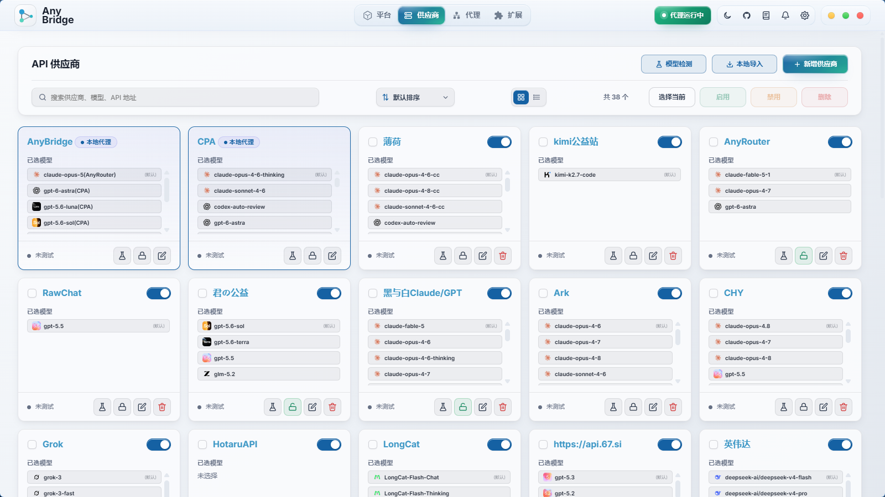
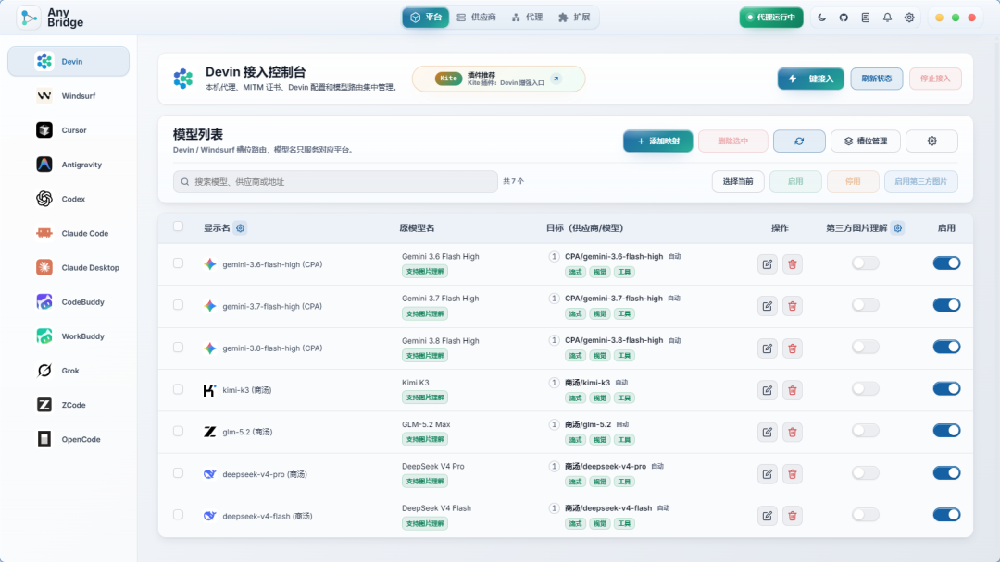
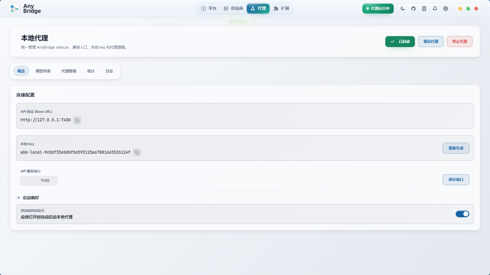
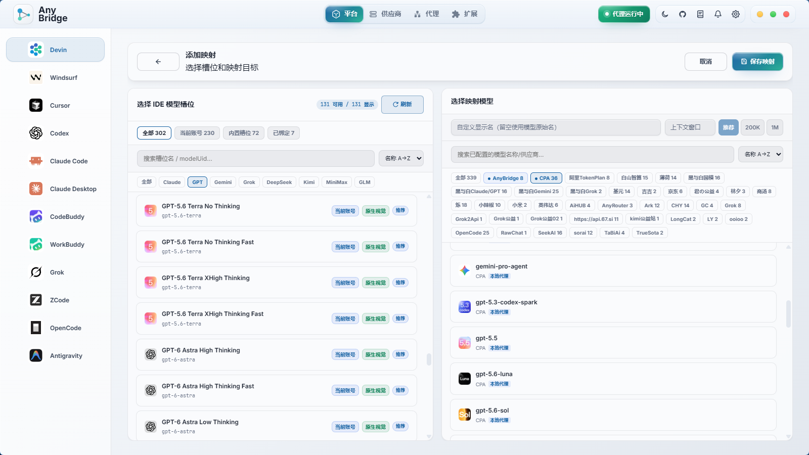
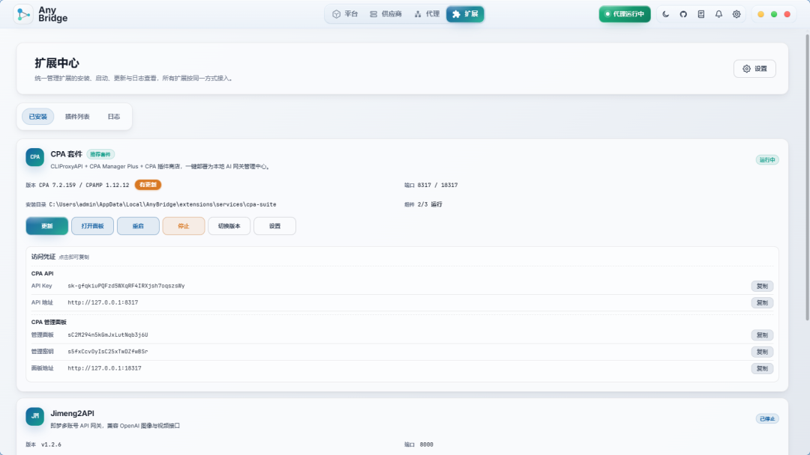
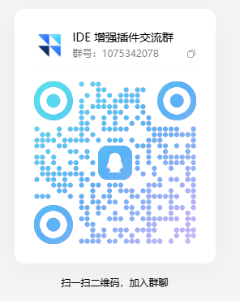

<div align="center">

# 🚀 AnyBridge

### 让每一款 AI 编程智能体自由接入你自己的模型渠道

**开源 · 本地优先 · BYOK（自带渠道 / 自带密钥）一站式接入工作台 · 支持 16+ 款智能体（桌面 IDE / 终端 CLI / 桌面客户端）**

[](LICENSE)
[](https://tauri.app/)
[]()
[](https://github.com/soulvon/AnyBridge/releases)

[English](README_en.md) • [简体中文](README.md)

[📥 下载安装](#-下载与安装) •
[⚡ 解决什么问题](#-它解决什么问题) •
[🚀 三步上手](#-快速上手只需三步) •
[🔌 三种接入方式](#-三种接入方式) •
[🎯 完整智能体清单](#-完整智能体清单) •
[✨ 核心能力](#-核心能力) •
[🔬 工作原理](#-工作原理与技术实现) •
[❓ FAQ](#-常见问题-faq) •
[💬 社区](#-社区交流与支持)

<br>

**不用再为每个工具手写配置，也不用被官方模型锁死。**

AnyBridge 是一款运行在本地的 **BYOK（Bring Your Own Key）模型接入与配置管理客户端**。它把第三方中转站（OneAPI / NewAPI / CPA 等）、自建网关、以及 DeepSeek、Claude、GPT、Gemini、GLM、Kimi 等模型，统一接入你日常使用的 AI 编程智能体：桌面 IDE、终端 CLI 与桌面客户端。

全部操作在图形界面完成：**不手写 JSON、不改环境变量、不碰二进制文件**，随时一键还原官方配置。

</div>

---

## 📥 下载与安装

桌面安装包开箱即用，**无需安装 Node.js、Python 或任何命令行环境**，双击即可运行：

👉 **[下载 AnyBridge 最新正式版（GitHub Releases）](https://github.com/soulvon/AnyBridge/releases/latest)**

| 操作系统 | 推荐安装包 | 安装与运行说明 |
| :--- | :--- | :--- |
| **🪟 Windows** | `.msi` 或 `Setup.exe` | 双击运行安装向导，按提示一路下一步即可完成 |
| **🍏 macOS** | `.dmg` | 双击打开镜像，将 AnyBridge 拖入「应用程序 (Applications)」目录（Apple Silicon 与 Intel 均有对应包） |
| **🐧 Linux** | `.AppImage` 或 `.deb` | 双击直接运行（AppImage 需先授予可执行权限：`chmod +x *.AppImage`） |

---

## ⚡ 它解决什么问题

| 你遇到的问题 | 默认情况 / 手动处理 | AnyBridge 的处理方式 |
| :--- | :--- | :--- |
| **智能体无法填第三方模型** | Cursor、Windsurf、Devin 等界面封闭，没有自定义 API 入口 | **本地代理接管**：通过本机代理接管会话请求，自由连接你的渠道与模型 |
| **手写配置文件繁琐易错** | Claude Code、Codex、Pi、Hermes 等要找隐藏目录手写 JSON / YAML / TOML | **界面一键写入**：选好模型直接写入正确路径，格式不出错，随时一键还原 |
| **每次都要手输模型名** | 很多工具需要手动输入长串模型名，输错一个字母就报错 | **在线拉取模型**：填好渠道后在线拉取可用模型列表，下拉框直接勾选 |
| **换个渠道每个工具都要改** | 有几个工具就得改几遍，上游换地址要挨个翻配置文件 | **一次配置多处复用**：渠道集中在 AnyBridge 管理，配一次同步给所有智能体 |
| **纯文本模型看不了截图** | 给 DeepSeek 等纯文本模型发报错截图，直接报错或被拒 | **看图备用（Vision Fallback）**：自动调用轻量视觉模型把图片转成文字描述 |
| **外部脚本无法共用配置** | 配置只给单个 IDE 用，其他脚本或小工具无法复用 | **本地统一网关**：暴露标准 OpenAI 兼容接口 `http://localhost:7450/v1`，任何客户端都能连 |
| **本地聚合网关部署麻烦** | 自建聚合网关要拉 Docker、配环境 | **内置扩展中心**：一键安装、启动、停止本地 CPA 网关套件 |
| **多个智能体换着用** | 不同场景用不同工具，配置分散且重复 | **统一管理**：16+ 款智能体统一在一个控制台里切换 |
| **英文界面上手有门槛** | Antigravity 等工具界面全英文，设置项理解成本高 | **界面一键汉化**：内置本地化引擎与在线词库，不会误译代码与思考链 |

---

## 🚀 快速上手（只需三步）

```
[第一步：添加渠道商] ──► [第二步：选择智能体一键启用] ──► [第三步：打开工具直接用]
```

### 1️⃣ 第一步：添加或导入渠道商（支持在线拉取模型）

打开 AnyBridge，进入 **「供应商」** 页面：

- **直观添加与拉取**：点击「添加供应商」，填入渠道地址与 API 密钥，**支持直接在线拉取模型列表**，在下拉框中勾选你想用的模型；
- **一键导入生态配置**：自动扫描并一键导入 **Cherry Studio**、**CC Switch**、**Cockpit Tools** 中已配置好的渠道商与模型，导入前可预览候选并自动去重；
- **连通性一键体检**：填完点「测试」，自动检测接口连通、模型列表、流式响应、工具调用与视觉多模态能力。

### 2️⃣ 第二步：选择你要接入的智能体（一键直配）

进入 **「智能体」** 页面，找到你顺手的工具（Cursor、Windsurf、Devin、Claude Code、Codex、Pi、Hermes、DeepSeek Harness ……）：

- **封闭式桌面 IDE（Cursor / Windsurf / Devin）**：点击「启用代理接管」，自动建立本地代理与证书，按提示重启即可；
- **配置型智能体（Claude Code / Codex / OpenCode / Pi / Hermes / DeepSeek Harness / Grok / ZCode / CodeBuddy / WorkBuddy 等）**：点击「切换到 AnyBridge」，**无需手写配置**，自动写入对应系统路径。

### 3️⃣ 第三步：打开工具，直接开用！

和平时一样打开你的 IDE 或终端，正常提问和写代码，请求就已经无缝切到你配置的自定义模型了。

> 💡 **随时一键还原**：在任意智能体页面点击「恢复原始配置」，秒级切回官方默认状态。

---

## 🖼️ 界面预览

全图形化操作，涵盖**渠道商管理**、**模型槽位映射**、**看图备用**、**智能体一键接入**与**扩展中心**：











---

## 🔌 三种接入方式

不同智能体的底层架构不同，AnyBridge 会按工具特性自动选择最合适的接入方式：

| 方式 | 适用智能体 | 是否需要保持 AnyBridge 运行 | 说明 |
| :--- | :--- | :--- | :--- |
| **本地代理接管** | Cursor、Windsurf、Devin | ✅ 需要 | 官方界面封闭，由本机代理（`:7450`）实时转译会话请求，同时提供看图备用、故障切换、重试与统计 |
| **配置文件直写** | Claude Code、Codex、OpenCode、Pi、Hermes、DeepSeek Harness、Grok、ZCode、CodeBuddy、WorkBuddy、Claude Desktop、Antigravity 等 | ❌ 不需要 | 自动写入原生配置文件（JSON / YAML / TOML），写完即可关闭 AnyBridge，工具直连你的渠道 |
| **本地 API 网关** | Cline、Continue、Aider 及任意自定义客户端 | ✅ 需要 | 统一暴露 OpenAI / Anthropic 兼容端点 `http://localhost:7450/v1`，任何支持自定义 API 的工具都能接入 |

> **怎么选？** 固定单一渠道 → 用直写，链路最短；需要多渠道聚合、备用模型、看图降级与统一日志 → 用代理或网关。

---

## 🎯 完整智能体清单

AnyBridge 针对不同工具的底层架构提供针对性的接入机制，目前已支持 **16 款智能体**，外加通过本地网关接入的任意外部生态：

| 分类 | 智能体 | 形态 | 接入机制与特点 | 状态 |
| :--- | :--- | :--- | :--- | :--- |
| **桌面 IDE** | **Cursor** | 桌面 IDE | 本地透明代理：拦截会话 RPC，补全与索引走官方原生链路 | ✅ 支持 |
| | **Windsurf** | 桌面 IDE | 本地透明代理：Connect-RPC 协议转译，模型槽位自由替换 | ✅ 支持 |
| | **Devin** | 桌面 IDE | 本地透明代理：会话流式转译，支持多模态看图备用 | ✅ 支持 |
| | **Antigravity IDE** | VS Code 架构编辑器 | 原生配置写入与环境变量同步，支持界面一键汉化 | ✅ 支持 |
| **桌面客户端** | **Codex Desktop** | 桌面客户端 | 运行时 CDP 动态注入：免改二进制，下拉菜单直接选自选模型 | ✅ 支持 |
| | **Claude Desktop** | 桌面客户端 | 原生配置快捷写入：自动写入配置文件，支持一键切换与还原 | ✅ 支持 |
| | **Antigravity** | 独立桌面端 Agent | 端点补丁注入 + 配置写入双通道，支持界面一键汉化 | ✅ 支持 |
| **终端 CLI** | **Claude Code** | 终端 CLI | 原生配置安全写入：免手写 JSON，支持 Thinking 思考参数与专属解锁 | ✅ 支持 |
| | **Codex CLI** | 终端 CLI | 原生配置文件自动写入，无缝接入中转站与自建端点 | ✅ 支持 |
| | **OpenCode** | 终端 CLI | 配置追加写入：保留已有供应商，免去手动改环境变量 | ✅ 支持 |
| | **Grok** | 终端 CLI | 原生 config.toml 写入，支持一键切换与还原 | ✅ 支持 |
| | **Pi** | 终端 CLI | 写入 `models.json` 的 providers，**按供应商分组**，支持模型单独启停与一键还原 | ✅ 支持 |
| | **Hermes** | 终端 CLI | 写入 `config.yaml` 的 custom_providers，**按供应商分组收敛模型与密钥**，保留原文注释 | ✅ 支持 |
| | **DeepSeek Harness** | 终端 CLI | 写入 `settings.yaml` 的 llm-pi-ai.providers（**按供应商分组**），密钥独立存于 `.credentials.yaml` | ✅ 支持 |
| **助手与应用** | **CodeBuddy** | 桌面端 / 插件 | 腾讯代码助手原生配置快捷写入，支持能力标签与一键备份还原 | ✅ 支持 |
| | **WorkBuddy** | 桌面端 / 插件 | 团队代码助手原生配置写入，支持与 CodeBuddy 双端同步 | ✅ 支持 |
| | **ZCode** | 命令行 / 插件 | 原生嵌套配置写入 + JSON 编辑器，支持导入导出 | ✅ 支持 |
| **外部生态** | **Cline / Continue / Aider 等** | 第三方插件与脚本 | 本地反代网关：统一监听 `http://localhost:7450/v1` 的 OpenAI / Anthropic 兼容端点 | ✅ 支持 |

---

## ✨ 核心能力

- **🧭 模型槽位映射**：把客户端写死的模型槽位（如 Cursor 的 `cursor-small`、Windsurf 的 `Claude Sonnet`）映射到你真正想用的模型。
- **🖼️ 看图备用（Vision Fallback）**：纯文本模型也能处理截图，支持全局或按渠道单独指定视觉模型（Mimo / MiniMax / Gemini Flash）。
- **🔓 专属解锁（Unlock）**：自动补齐官方客户端协议指纹（`anthropic-beta` 头、Thinking 参数、会话元数据），让任意智能体畅享中转站的 Claude Code / Codex 专属专线，避免 503 / 400 拒绝。
- **💉 Codex 桌面增强**：通过 CDP 运行时注入把自定义模型加进下拉列表，不改任何二进制文件。
- **🔁 稳定性保障**：故障自动切换、429 限流自动重试、并发控制、长推理超时保护、退出自动还原代理。
- **📊 实时监控看板**：请求走势、成功失败分布、输入/输出 Token 消耗、各渠道平均延迟与可用性。
- **🧪 能力一键体检**：连通性、模型列表、流式 SSE、工具调用、视觉多模态逐项检测。
- **📐 上下文窗口预设**：内置主流模型（Claude / GPT / DeepSeek / GLM / Qwen 等）推荐参数，避免长代码被截断。
- **🧩 CPA 扩展中心**：一键部署与管理本地网关套件（CLIProxyAPI + CPA Manager Plus + 插件商店）。
- **🔧 自定义请求头**：为企业内网、自建网关或私有鉴权场景自由添加 Custom Headers。
- **📁 会话历史保护**：切换渠道或登录态时自动维护会话索引，官方历史记录不丢失。
- **🌐 界面一键汉化**：内置本地化引擎与在线词库热更新，代码与思考链不会被误译。

---

## 🔬 工作原理与技术实现

```
                           ┌───────────────────────────┐
                           │    AnyBridge 桌面端       │
                           │   (Tauri v2 + Rust)       │
                           └─────────────┬─────────────┘
                                         │ 本地控制
                                         ▼
┌─────────────────────────────────────────────────────────────────────────────┐
│                            本地代理服务 (:7450)                              │
│   ┌───────────────────────┐   ┌───────────────────────┐   ┌─────────────┐   │
│   │   协议解析与转换      │   │  看图备用自动转写     │   │ 渠道切换与  │   │
│   │ (Connect-RPC / SSE)   │   │   (Vision Fallback)   │   │ 限流自动重试│   │
│   └───────────────────────┘   └───────────────────────┘   └─────────────┘   │
└───────────────▲───────────────────────────────▲──────────────────────▲──────┘
                │ 本地代理                      │ 调试端口注入 (CDP)   │ 配置写入 / 网关
    ┌───────────┴───────────┐       ┌───────────┴───────────┐          │
    │ Cursor / Windsurf /   │       │  Codex 桌面客户端     │  ┌────────┴──────────┐
    │ Devin（Connect-RPC）  │       │（动态添加模型选项）   │  │ Claude Code / Pi /  │
    └───────────────────────┘       └───────────────────────┘  │ Hermes / DSH / 外部│
                                                               └───────────────────┘
```

### 本地代理模式是怎么工作的？（以 Cursor / Windsurf / Devin 为例）

```
智能体发出请求
    │
    ▼
[AnyBridge 本地代理 (127.0.0.1:7450)]
    ├─► 1. 识别请求类型：只拦截聊天会话（如 GetChatMessage）
    ├─► 2. 解出对话内容，转换为标准 OpenAI 或 Anthropic 格式发给你的渠道
    ├─► 3. 收到流式回复后，重新打包为 Connect-RPC 格式推回界面
    │
    ▼
其他非聊天流量（代码补全、文件索引、账号登录）
    └─► 原样放行，走官方链路，不增加额外延迟
```

- **不影响日常使用**：只有聊天窗口提问才经过转换，自动补全和登录仍走官方通道；
- **本地证书自动生成**：首次开启自动生成并信任本地证书，无需手动配置；
- **跨协议自动转译**：上游 Anthropic、下游 OpenAI（或反过来）自动完成参数与流式事件互转。

### 配置文件直写模式是怎么工作的？

这些智能体本身支持在配置文件里填自定义 Base URL 与密钥，AnyBridge 只是帮你**找到隐藏目录并规范写入**（写入前自动备份）：

| 智能体 | 写入的配置文件 |
| :--- | :--- |
| Claude Code | `~/.claude/settings.json` |
| Codex CLI | `~/.codex/config.toml` |
| OpenCode | `~/.config/opencode/opencode.json` |
| Pi | `~/.pi/agent/models.json`（默认模型写入 `settings.json`） |
| Hermes | `~/.hermes/config.yaml`（Windows 为 `%LOCALAPPDATA%\hermes\config.yaml`） |
| DeepSeek Harness | `~/.dsh/settings.yaml` + `~/.dsh/.credentials.yaml` |
| Grok | `~/.grok/config.toml` |

写入结果遵循**按供应商分组**的结构：同一供应商（名称、端点、密钥相同）的模型收敛为一个渠道条目，模型按 ID 展示，不再出现一长串重复名称；只维护 AnyBridge 写入的条目，用户手写内容与文件注释原样保留。

---

## ❓ 常见问题 FAQ

<details>
<summary><b>Q1: 使用 AnyBridge 会影响 IDE 原生的代码补全速度吗？</b></summary>
<br>
<b>完全不会。</b>AnyBridge 仅对会话窗口的对话请求进行拦截和模型转换；代码行间自动补全、本地符号索引检索、官方登录鉴权等流量 100% 走官方原生链路直接透传，代码提示保持毫秒级流畅。
</details>

<details>
<summary><b>Q2: 我的 API 密钥、中转站地址和代码安全吗？</b></summary>
<br>
<b>安全。</b>AnyBridge 是 100% 运行在你本地计算机上的开源软件，没有任何收集用户隐私的远程服务器。所有密钥、地址与会话内容都保存在本地，源码完全开源，欢迎随时审计。
</details>

<details>
<summary><b>Q3: 支持哪些第三方中转站和自建网关？</b></summary>
<br>
<b>几乎支持市面上所有兼容服务。</b>只要支持标准 OpenAI 格式（OneAPI、NewAPI、各类商业中转）或 Anthropic 格式（各类 Claude 专线），填入 Base URL 与密钥即可生效；也支持在扩展中心一键部署本地 CPA 网关。
</details>

<details>
<summary><b>Q4: 会导致官方账号被封号吗？</b></summary>
<br>
<b>不会。</b>AnyBridge 不篡改智能体客户端的底层二进制文件，仅在本机作为环回代理工作，登录验证与遥测完全原样放行。
</details>

<details>
<summary><b>Q5: 不想用了，怎样恢复到官方默认状态？</b></summary>
<br>
<b>秒级一键还原。</b>在「智能体」页面找到对应工具，点击「恢复原始配置」，AnyBridge 会清除代理规则并把配置还原为出厂默认值；关闭软件时也会自动复原网络环境。
</details>

<details>
<summary><b>Q6: 怎么快速验证本地代理服务是否正常？</b></summary>
<br>
访问 <code>http://localhost:7450/__byok/health</code>，返回 <code>{"status":"ok"}</code> 即表示服务正常；访问 <code>http://localhost:7450/__byok/stats</code> 可查看实时聚合统计。
</details>

<details>
<summary><b>Q7: 配置文件保存在哪里？换电脑如何迁移？</b></summary>
<br>
<ul>
  <li><b>Windows</b>: <code>%APPDATA%\anybridge\providers.json</code></li>
  <li><b>macOS</b>: <code>~/Library/Application Support/anybridge/providers.json</code></li>
  <li><b>Linux</b>: <code>~/.config/anybridge/providers.json</code></li>
</ul>
复制到新设备对应目录即可无缝还原全部配置。
</details>

<details>
<summary><b>Q8: 遇到调用异常或接口报错怎么排查？</b></summary>
<br>
在控制台设置菜单中使用<b>「一键导出日志」</b>查看实时运行日志与报错堆栈；客户端内置新版本自动检测，发布新版后会提醒更新。
</details>

---

## ⚠️ 安全与隐私说明

- **纯本地运行**：不设任何收集用户数据的远程云端后台；
- **凭证本地留存**：API 密钥、中转站地址与对话上下文完全保存在本地磁盘，绝不上传；
- **开源免责声明**：本项目为独立开源开发辅助工具，与 Cursor、Windsurf、Devin、OpenAI、Anthropic 等商业公司无任何官方隶属或商业背书关系。

---

## 💬 社区交流与支持

如果 AnyBridge 为你节省了折腾成本，欢迎进群交流各智能体的使用心得与调优配置。

特别鸣谢 [Linux.do](https://linux.do) 社区各位佬友的大力支持与反馈！

<div align="center">

| 💬 QQ 交流群（1075342078） | ☕ 微信赞赏（请作者喝杯咖啡） |
| :---: | :---: |
|  |  |
| 验证信息请注明 "AnyBridge" | 感谢你的支持与鼓励！ |

</div>

---

## 🛠️ 开发者指南（源码运行与打包）

> 💡 普通用户请直接下载安装包，无需阅读本节。

### 1. 环境依赖
- **Node.js** >= 20
- **Rust** 工具链（用于 Tauri 桌面端编译）
- **Python 3**（用于代理打包脚本）

### 2. 源码启动
```bash
git clone https://github.com/soulvon/AnyBridge.git
cd AnyBridge
npm install
cd sidecar && npm install && cd ..

# 构建 sidecar 二进制（输出到 src-tauri/binaries/，已被 Git 忽略，首次必须执行）
python scripts/build/build_sidecar_plain.py
python scripts/build/build_cursor_core.py

# 启动桌面开发模式
npm run tauri:dev
```

> ⚠️ `npm run tauri:dev` 不会自动构建 sidecar。若修改了 `sidecar/` 或 `cursor-core/` 代码，需重新执行对应脚本。

### 3. 构建发布包
```bash
npm run tauri:build
```
产物位于 `src-tauri/target/release/bundle/`。

---

## 📄 开源协议

[MIT](LICENSE) © 2026 [soulvon](https://github.com/soulvon)

---

<div align="center">

**AnyBridge · 打破模型锁定，把选择权交回开发者**

关键词：BYOK 自带密钥 · AI 编程智能体 · 本地代理 · OpenAI 兼容接口 · 模型路由与聚合 · 中转站接入 · Claude Code / Codex / Cursor / Pi / Hermes 配置管理

</div>
