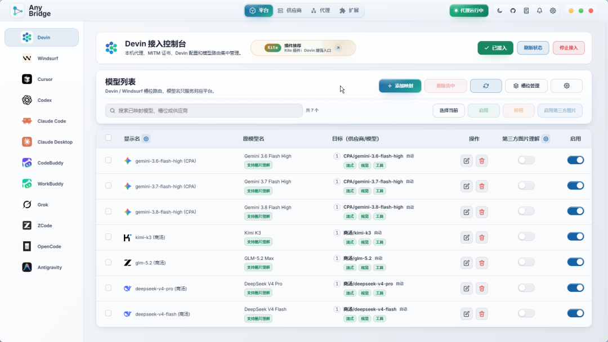

# AnyBridge: 统一管理供应商，支持 Windsurf/Devin/Cursor/Claude Code/Codex 直观接入自定义模型

各位佬友，发个自己为了解决日常折磨写出来的开源小工具。

## 为什么做这个东西

这个工具最开始的起因其实非常单纯：**就是想在 Devin 上搞定 BYOK（自带 Key）**。

当时 Devin 界面完全封闭，根本不给配自定义模型，但平时干活总想用自己手里的 API 渠道。后来折腾了一通本地 MITM 代理，精准把 Devin 内部私有 RPC 的聊天请求截获、成功无缝转接上了自己的供应商。

搞定 Devin 之后，我发现这套折磨其实是个普遍现象：
平时写代码，估计不少人和我一样，手上装着不止一个 AI 工具：
- 桌面主力可能开着 Windsurf、Devin 或 Cursor；
- 终端跑自动化或改项目时，习惯调 Claude Code、Codex CLI；
- 偶尔在编辑器里还开着 OpenCode、Cline。

工具一多，**模型和供应商配置完全是一地鸡毛**：
手里不管是 Anthropic、OpenAI、DeepSeek、国产大模型，还是自己买的转发站，只要上游换个 Key、换个域名，或者想测个新模型，就得把各个工具翻个底朝天：
- Claude Code 得去找它的配置文件改 json；
- 命令行工具要去改环境变量，改完还得重启终端；
- Windsurf 和 Devin 一样封闭，官方界面压根不留填自定义 Key 的入口；
- Codex 桌面版就算你在配置文件里写了三方端点，前端界面的模型下拉框依然只显示官方那几样，根本选不到自己的模型。

换一次配置要改三四处地方，改漏一个就报错。更头疼的是，想用便宜的 DeepSeek 刷代码，遇到报错截图随手往里一扔，模型直接弹窗报错说“不支持图片”。这时候只能把图删掉，耐着性子自己敲键盘把报错信息抄一遍，极度影响心流。

既然 Devin 的代理路子走通了，那为什么不顺藤摸瓜，把其他这些工具也全给串起来？
于是我把原本给 Devin 写的打补丁脚本彻底重构成了一个本地桌面工具 —— **AnyBridge**。

核心逻辑就一条：**把所有供应商在本地统一管起来，然后直观地接进你常用的各个 IDE，不用到处翻文件改配置，也不被官方的默认限制卡脖子。**

---

## 具体怎么解决这些痛点的

### 1. 供应商只配一次，不用四处复制粘贴
界面里统一配置好你的各个渠道（格式支持 Anthropic、OpenAI 以及各种兼容端点）。
如果你之前在 Cherry Studio、CC Switch 里配过一堆 Key，可以直接点一键导入，它会自动扫描本机已有的配置带进来，省得挨个重新手填。

### 2. 针对不同的 IDE，用最省事的方式接进去
每个工具底层的机制不一样，AnyBridge 按工具类型做了直观接入：

- **Windsurf / Devin / Cursor（封闭桌面 IDE）**
  这些 IDE 走的是私有 RPC 协议，原本没法配自定义 Key。
  AnyBridge 在本地起了一个代理，只拦截聊天相关的请求，转给你配置的模型；像代码补全、本地代码索引、账号登录这些流量完全原路放行，保证 IDE 原本的补全速度和正常功能不受影响。
- **Claude Code / Codex CLI / OpenCode（配置文件型）**
  不用自己去翻系统目录找各种 config.json。在 AnyBridge 界面里选好工具和想用的供应商，点一下“切换”，后台自动按该工具的格式写进对应位置；想换回官方原生状态，再点一下恢复即可。
- **Codex 桌面版（模型下拉列表锁定）**
  Codex 桌面版界面写死了模型选项。AnyBridge 通过 CDP（Chrome 调试协议）在启动时把配置好的自定义模型动态塞进下拉菜单里，按供应商排好。不用反编译修改程序本体，关掉就恢复。
- **通用 OpenAI 兼容接口**
  本地提供了一个标准的 `http://localhost:7450/v1` 接口，任何支持填自定义地址的插件（比如 VSCode 的 Cline、Continue）都能直接连。

### 3. 让 DeepSeek 也能“看懂”报错截图（Vision Fallback）
这个是我日常用得最顺手的一个小功能。
DeepSeek、GLM 等纯文本模型写代码很划算，但不支持多模态。平时把报错截图或者设计稿扔进对话框，往往直接报错中断。

AnyBridge 在代理层加了个回退：
- 当检测到请求里带了图片，而你当前选的模型不支持看图时；
- 它会先把图片在后台发给配置好的轻量视觉模型（比如 Mimo、MiniMax 或其他多模态模型）提炼出文字；
- 把图片替换成这段文字描述后，再发给 DeepSeek 回答。

整个过程在后台自动完成，不需要你先找看图工具把报错打成字再复制过来，直接扔截图就能继续聊。

### 4. 避免断联的调度处理
自己接 API 最怕写一半卡死。AnyBridge 做了几项基本防护：
- **故障自动切备用**：当前渠道超时或报 5xx 时，自动换下一个可用供应商；
- **智能重试**：遇到 429 限流或网络抖动，自动按梯度重试，不直接弹报错；
- **并发闸门与超时控制**：长流式输出不会被单一超时误杀，同时限制突发并发，防止一下子把上游打挂。

---

## 隐私与安全

写给开发者用的工具，底线一定要交代清楚：
- **纯本地运行**：基于 Tauri v2 桌面壳 + 本地 Rust/Node 服务，没有做任何云端中转服务器；
- **配置存在本机**：你的 Key、模型映射和日志全在本地目录；
- **完全开源**：代码在 GitHub，所有请求行为欢迎抓包验证。

---

## 截图预览

*(目前已完整支持 Devin、Windsurf、Cursor、Codex、Claude Code、Claude Desktop、CodeBuddy、WorkBuddy、Grok、ZCode、OpenCode、Antigravity 等 12 个平台，右侧直观管理各槽位到真实供应商/模型的映射关系，支持流式、视觉、工具调用标记与第三方图片理解开关)*

---

## 项目地址与体验

- **GitHub 源码**：https://github.com/soulvon/AnyBridge
- **安装包 Releases**：https://github.com/soulvon/AnyBridge/releases
- **开源协议**：MIT

代码刚整理开源不久，如果有用着不顺手的地方、或者想接哪个新工具，欢迎在帖子里反馈交流，或者去提 Issue，看到都会跟进修复。
